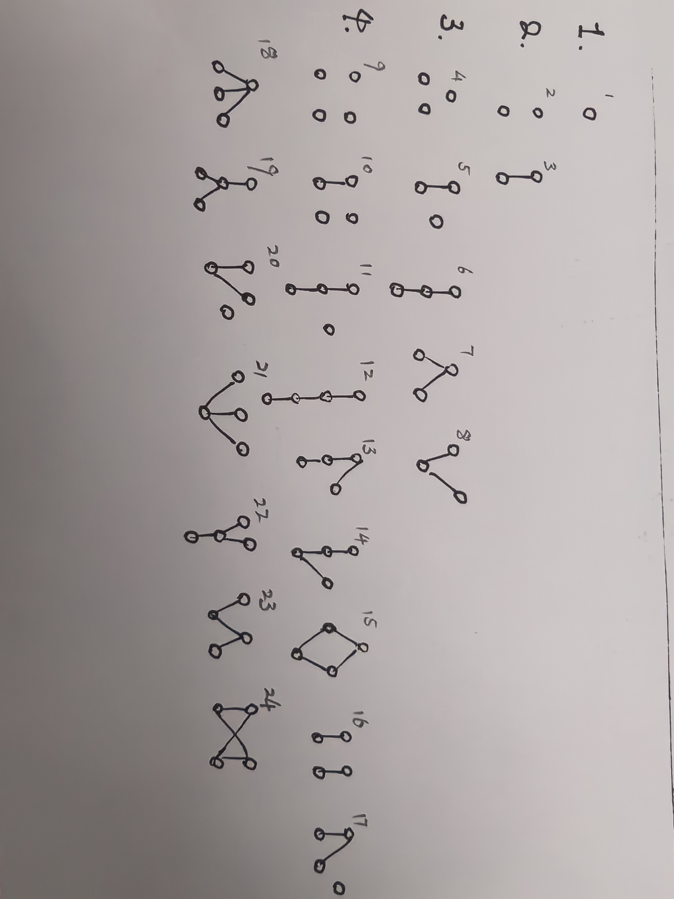

$$
\mathscr{Lorain~wy~Lora~blea.}

\newcommand{\DS}[0]{\displaystyle}

% operators alias
\newcommand{\opn}[1]{\operatorname{#1}}
\newcommand{\card}[0]{\opn{card}}
\newcommand{\lcm}[0]{\opn{lcm}}
\newcommand{\char}[0]{\opn{char}}
\newcommand{\Char}[0]{\opn{Char}}
\newcommand{\Min}[0]{\opn{Min}}
\newcommand{\rank}[0]{\opn{rank}}
\newcommand{\Hom}[0]{\opn{Hom}}
\newcommand{\End}[0]{\opn{End}}
\newcommand{\im}[0]{\opn{im}}
\newcommand{\tr}[0]{\opn{tr}}
\newcommand{\diag}[0]{\opn{diag}}
\newcommand{\coker}[0]{\opn{coker}}
\newcommand{\id}[0]{\opn{id}}
\newcommand{\sgn}[0]{\opn{sgn}}
\newcommand{\Res}[0]{\opn{Res}}
\newcommand{\Ad}[0]{\opn{Ad}}
\newcommand{\ord}[0]{\opn{ord}}
\newcommand{\Stab}[0]{\opn{Stab}}
\newcommand{\conjeq}[0]{\sim_{\u{conj}}}
\newcommand{\cent}[0]{\u{\degree C}}
\newcommand{\Sym}[0]{\opn{Sym}}
\newcommand{\Var}[0]{\opn{Var}}
\newcommand{\wg}[0]{\wedge}
\newcommand{\Wg}[0]{\bigwedge}
\newcommand{\sq}[0]{\opn{\square}}

% symbols alias
\newcommand{\E}[0]{\exist}
\newcommand{\A}[0]{\forall}
\newcommand{\l}[0]{\left}
\newcommand{\r}[0]{\right}
\newcommand{\ox}[0]{\otimes}
\newcommand{\lra}[0]{\leftrightarrow}
\newcommand{\llra}[0]{\longleftrightarrow}
\newcommand{\iso}[1]{\overset{\sim}{#1}}
\newcommand{\eps}[0]{\varepsilon}
\newcommand{\Ra}[0]{\Rightarrow}
\newcommand{\Eq}[0]{\Leftrightarrow}
\newcommand{\d}[0]{\mathrm{d}}
\newcommand{\e}[0]{\mathrm{e}}
\newcommand{\i}[0]{\mathrm{i}}
\newcommand{\j}[0]{\mathrm{j}}
\newcommand{\k}[0]{\mathrm{k}}
\newcommand{\Ex}[0]{\mathbb{E}}
\newcommand{\D}[0]{\mathbb{D}}
\newcommand{\oo}[0]{\infty}
\newcommand{\tto}[0]{\rightrightarrows}
\newcommand{\mmap}[0]{\hookrightarrow}
\newcommand{\emap}[0]{\twoheadrightarrow}
\newcommand{\actl}[0]{\curvearrowright}
\newcommand{\actr}[0]{\curvearrowleft}
\newcommand{\nsubg}[0]{\triangleleft}
\newcommand{\nsupg}[0]{\triangleright}
\newcommand{\lin}[0]{\lim_{n\to\oo}}
\newcommand{\linf}[0]{\liminf_{n\to\oo}}
\newcommand{\lsup}[0]{\limsup_{n\to\oo}}
\newcommand{\ser}[0]{\sum_{n=1}^\oo}
\newcommand{\serz}[0]{\sum_{n=0}^\oo}
\newcommand{\isoto}[0]{\overset\sim\to}
\newcommand{\F}[0]{\mathbb F}
\newcommand{\x}[0]{\times}
\newcommand{\M}[0]{\mathbf{M}}
\newcommand{\T}[0]{\intercal}
\newcommand{\Co}[0]{\complement}
\newcommand{\alp}[0]{\alpha}
\newcommand{\lmd}[0]{\lambda}
\newcommand{\mmid}[0]{\parallel}
\newcommand{\loop}[0]{\circlearrowleft}
\newcommand{\go}[0]{\triangleright}

% symbols with parameters
\newcommand{\der}[1]{\frac{\d}{\d #1}}
\newcommand{\ul}[1]{\underline{#1}}
\newcommand{\ol}[1]{\overline{#1}}
\newcommand{\wt}[1]{\widetilde{#1}}
\newcommand{\br}[1]{\l(#1\r)}
\newcommand{\bk}[1]{\l[#1\r]}
\newcommand{\ev}[1]{\l.#1\r|}
\newcommand{\wh}[1]{\widehat{#1}}
\newcommand{\eval}[1]{\l[\!\l[#1\r]\!\r]}
\newcommand{\abs}[1]{\l|#1\r|}
\newcommand{\bs}[1]{\boldsymbol{#1}}
\newcommand{\dat}[1]{\bs{\mathrm{#1}}}
\newcommand{\env}[2]{\begin{#1}#2\end{#1}}
\newcommand{\ALI}[1]{\env{aligned}{#1}}
\newcommand{\CAS}[1]{\env{cases}{#1}}
\newcommand{\pmat}[1]{\env{pmatrix}{#1}}
\newcommand{\algo}[1]{\begin{array}{r|l}#1\end{array}}
\newcommand{\dary}[2]{\l|\begin{array}{#1}#2\end{array}\r|}
\newcommand{\pary}[2]{\l(\begin{array}{#1}#2\end{array}\r)}
\newcommand{\pblk}[4]{\l(\begin{array}{c|c}{#1}&{#2}\\\hline{#3}&{#4}\end{array}\r)}
\newcommand{\u}[1]{\mathrm{#1}}
\newcommand{\t}[1]{\text{#1}}
\newcommand{\tb}[1]{\textbf{#1}}
\newcommand{\os}[2]{\overset{#1}{#2}}
\newcommand{\lix}[1]{\lim_{x\to #1}}
\newcommand{\ops}[1]{#1\cdots #1}
\newcommand{\seq}[3]{{#1}_{#2}\ops,{#1}_{#3}}
\newcommand{\dedu}[2]{\u{(#1)}\Ra\u{(#2)}}
\newcommand{\prv}[3]{\DS{{\DS #1} \over {\DS #2}}~(#3)}
$$

**1.**

&emsp;&emsp;a) 观察到 $aTSRd$ 描述的是 $\E b\in B, \E c\in C,~aRb\land bSc\land cTd$, 这显然是满足结合律的.

&emsp;&emsp;b) $\Delta_BR=\{(a,b')\in A\times B:\E b\in B,~aRb\land b\Delta_B b'\}$, 选择命题中只能有 $b=b'$, 所以 $\Delta_BR=\{(a,b)\in A\times B:aRb\}=R$. $R\Delta_A$ 同理.

&emsp;&emsp;c) 验证定义, 比较平凡.

&emsp;&emsp;d) 对某个 $xR^ny$, 能够取出一条链
$$
\lang x=a_0,a_1,\cdots,a_{n-1},a_n=y\rang\quad\l(\A k\in[0,n),~a_kRa_{k+1}\r).
$$
一方面, 如果传递性成立, 我们可以直接依赖这条链传递出 $xRy$; 另一方面, 对任意的 $xRy\land yR z$, 一定有 $xR^2 z$ 成立, 那么 $(x,z)\in R$, 也即是 $xR z$ 成立, 满足传递性.

&nbsp;

&emsp;&emsp;*(提问: 能否在适当的构造下, 让 $xRy$ 只能通过不可数次传递得到? 如果可以, 上述 d) 的结论是否仍然成立, 或者需要如何修正?)*

&emsp;&emsp;*一个构造尝试*&emsp;令 $S=\{0,1\}^\N$, 对 $f,g\in S$, 定义 $f\preceq g\Eq \A x\in\R,~f(x)\le g(x)$, 这显然是一个偏序关系. 现定义另一个序关系 $f\preceq' g$, 它满足:
$$
f\preceq'g\Eq\bigvee\begin{cases}
f=g,\\
\E!x_0\in \R,~f(x_0)<g(x_0)\land (\A x\neq x_0,~f(x)=g(x))\quad (*),\\
\E\{f_n\}\sub\mathcal P(S),~(f_0=f)\land (f_n\to g)\land (f_i,f_{i+1})\text{ holds }(*).
\end{cases}
$$
(第三项良定吗?) 是否有 $f\preceq g\Eq f\preceq' g$?

- 如果不满足, 为什么? (不能用选择公理之类的东西凑出来吗?)
- 如果满足, 再定义 $f \preceq^*g\Eq f\preceq' g\land\{x\in\N:f(x)\neq g(x)\}\text{ is finite}$, 这个序应当不满足传递性. 但是和 d) 的断言矛盾. 为什么?

> **Remark.**
>
> &emsp;&emsp;目前我觉得 $\preceq'\Eq\preceq$, 但是这三个序都是传递的. "是否传递" 还是验证定义更直观.

> **Supplementary.**
>
> &emsp;&emsp;这里我们实质上验证了 $\mathcal{Rel}$ 是范畴, 而 $\mathcal{Rel}$ 上的复合实质上就是 $\mathcal{Set}$ 上的复合.

&nbsp;

**2.**

&nbsp;

**3.**

&emsp;&emsp;如果 $A'$ 存在两个上确界 $a,a'$, 验证 $a$ 的定义知 $a\preceq a'$, 验证 $a'$ 的定义知 $a'\preceq a$, 因此 $a=a'$. 下确界同理.

> **Supplementary.**
>
> &emsp;&emsp;在偏序集对应的范畴内, $\sup A$ 实质上就是 $\coprod A$, $\inf A=\prod A$.

&nbsp;

**4.**

&emsp;&emsp;令 $S=\{x\in P:x\neq\theta(x)\}\sub P$, 根据 $P$ 的性质, $S$ 存在极大元 $a_0$, 由于 $\theta(a_0)\neq a_0$ 且 $a_0\preceq \theta(a_0)$, 不妨 $a_1=\theta(a_0)$, 则必然有 $a_1\notin S$, 这蕴含着 $a_1=\theta(a_1)$. 然而这里就有 $\theta(a_0)=\theta(a_1)=a_1$, 与 $\theta$ 是单射矛盾.

&nbsp;

**5.**

&emsp;&emsp;(本题中不加注明时, $a/b:=\lfloor\frac{a}{b}\rfloor$.)

&emsp;&emsp;(i)
$$
\begin{aligned}
	v_p(n!) &= v_p\l(\prod_{p\nmid t\in[1,n]}t\cdot\prod_{i=1}^{n/p}(pi)\r)\\
	&= v_p\l(\prod_{p\nmid t\in[1,n]}t\cdot p^{n/p}(n/p)!\r)\\
	&= n/p+v_p((n/p)!)\\
	&= \cdots\\
	&= \sum_{k=1}^\oo n/p^k.
\end{aligned}
$$
&emsp;&emsp;(ii) 若 $n=\sum_{k=0}^r a_kp^k$, 则 $n/p^t=\sum_{k=t}^r a_kp^{k-t}$, 代入知
$$
\begin{aligned}
	v_p(n!) &= \sum_{k=1}^\oo\sum_{i=k}^r a_ip^{i-k}\\
	&= \sum_{i=1}^r a_i\sum_{k=1}^i p^{i-k}\\
	&= \sum_{i=1}^r a_i\frac{1-p^i}{1-p}\\
	&= \frac{\sum_{i=1}^r a_ip^i+a_0-\sum_{i=1}^r a_i-a_0}{p-1}\\
	&= \frac{n-\sum_{i=0}^r a_i}{p-1}.
\end{aligned}
$$
&nbsp;

**6.**

&emsp;&emsp;(i) 除了 $2$, 素数仅有 $4n\pm 1$ 两种形式. 假设形如 $4n-1$ 的素数只有有限个, 则可以将他们列为 $q_1,q_2,\cdots,q_n$, 令 $Q=\prod_{i=1}^n q_i$, 讨论:

- $2\mid n$, 则 $Q\equiv(-1)^n\equiv 1\pmod 4$, $Q+2\equiv -1\pmod 4$, 同时明显有 $\A i\in[1,n],~q_i\nmid (Q+2)$, 如果 $Q+2$ 本身是一个素数, 那么它已经有 $4n-1$ 的形式; 否则由于 $1^n\equiv 1$, $Q+2$ 必须含有至少一个形如 $4n-1$ 的素数, 它也是一个新的 $4n-1$ 的素数, 二者都导致假设不成立.
- $2\nmid n$, 则 $Q\equiv -1\pmod 4$, $Q+4\equiv -1\pmod 4$, 也有 $\A i\in[1,n],~q_i\nmid (Q+4)$, 后续同理.

综上可知, 假设一定不成立. 则存在无穷多个形如 $4n-1$ 的素数.

&emsp;&emsp;(ii) 除了 $2,3$, 素数仅有 $6n\pm1$ 两种形式. 在上述讨论中, 将 "$2\mid n$" 情况下的 $Q+2$ 改为 $Q+4$, 将 $2\nmid n$ 情况下的 $Q+4$ 改为 $Q+6$, 其余完全类似.

---

**ex.**

&emsp;&emsp;(1.i) 自反, 反身性显然, 只验证传递性. 如果有 $p\sim q\land q\sim r$, 即 $\E s,t,~p-q=f\cdot s\land q-r=f\cdot t$, 那么 $p-r=f\cdot(s-t)$, 则也有 $p\sim r$.

&emsp;&emsp;(1.ii) 任取 $p_0=p+fs\in p+(f)$ 和 $q_0=q+ft\in q+(f)$, 其中 $s,t\in\C[x]$, 那么
$$
p_0+q_0=(p+q)+f(s+t)\in p+q+(f),\\
p_0q_0=pq+f(pt+qs+fst)\in pq+(f).
$$
因此, 无论如何选取代表元 $p_0$ 和 $q_0$, $+$ 和 $\times$ 都会得到相同的等价类, 它们是良定义的.

&emsp;&emsp;(2.i) $\varphi$ 可以写作 $\varphi:p+(f)\mapsto (p+(f))\times(x+(f))$, 根据 (1.ii), 它是良定义的. 对 $\C$-linear 性质, 直接验证
$$
\begin{aligned}
	\varphi(a(p+(f))+b(q+(f))) &= (a(p+(f))+b(q+(f)))\times (x+(f))\\
	&= (ap+bq)x+(f)\\
	&= a(px+(f))+b(qx+(f))\\
	&= a\varphi(p+(f))+b\varphi(q+(f)).
\end{aligned}
$$
&emsp;&emsp;(2.ii) *原题记号有误, 应从 $e_0$ (而非 $e_1$) 记起.* 对任意 $p,m\in\C[x]$, 其中 $m\neq 0$, 必然可以将 $p$ 写为 $p= p'm+r$, 其中 $\deg r<\deg m$, 且 $r$ 明显是唯一确定的, 定义 $r:=p\bmod m$. 本题中, 任取代表元 $y\in Y$ 只需要构造
$$
Y_k=\frac{y\bmod (x-\lambda)^{k+1}-y\bmod (x-\lambda)^k}{(x-\lambda)^k}.
$$
分子有因式 $(x-\lambda)^k$, 所以至少 $Y_k\in\C[x]$. 同时分子 $\deg\le k$, 所以只能有 $\deg Y_k=0$, 也即 $Y_k\in\C$, 满足条件.

&emsp;&emsp;(2-iii) 已知 $\varphi((x-\lambda)^i)\equiv x(x-\lambda)^i\equiv e_ja_i^j\pmod{(x-\lambda)^n}$. 观察最高次项, 有 $a_i^{i+1}=1$, 接着次高次项有 $a_i^i=\lambda$, 这样就有
$$
x(x-\lambda)^i=(x-\lambda)^{i+1}+\lambda(x-\lambda)^i.
$$
通过 (2.ii) 的构造, 我们知道这样的 $a$ 是唯一的. 因此
$$
a_i^j=\begin{cases}
1,&j=i+1;\\
\lambda,&j=i;\\
0,&\text{otherwise}.
\end{cases}
$$

> **Supplementary.**
>
> &emsp;&emsp;$\C[x]/(f)$ 可以被一一映射到一个 $\C^{\deg f}$ 的线性空间, 可以认为 $\C[x]/(f)=\opn{span}\{1,x,\cdots,x^{\deg f-1}\}$.
>
> &emsp;&emsp;最后的 $A$ 是一个 Jordan Block.
>
> &emsp;&emsp;对给定线性空间 $V$, 映射 $A:V\to V$ 和一个 $\C[x]$ 在 $V$ 上的作用: $\C[x]\times V\to V,(p,v)\mapsto p(v)$, 即
> $$
> \l(\sum_ia_ix^i,v\r)\mapsto\sum_ia_iA^i(v).
> $$
> 他尝试让我听懂这是 statement of finitely generated module over a PID 的推论.

---

**Supplementary.**

&emsp;&emsp;$\Z\sub\Z_p\sub\Q_p$.

&emsp;&emsp;先扩展上文 $v_p$ 的定义:
$$
v_p:\Q\to\Z\sqcup\{\oo\},~0\mapsto\oo,~\frac{b}{a}\mapsto v_p(b)-v_p(a).
$$

进而定义

$$
|\cdot|_p:\Q\to\Z\sqcup\{\oo\},a\mapsto\frac{1}{p^{v_p(a)}}.
$$

有性质

- $|a|_p\ge 0$.
- $|ab|_p=|a|_p|b|_p$.
- $|a+b|_p\le\max\{|a|_p,|b|_p\}$, 可见这是强于范数要求的, 称为强三角不等式.

&emsp;&emsp;(Tip: $\R$ 可以视作 $\Q$ 对 Cauchy 列的完备化, 而这里将 Cauchy 列的某种 $\|\cdot\|$ 替换成 $|\cdot|_p$ 就能将 $\Q$ 完备化为 $\Q_p$.)
