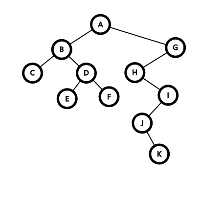
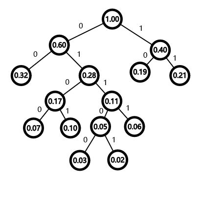
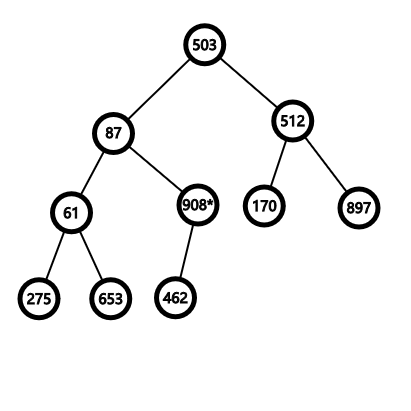
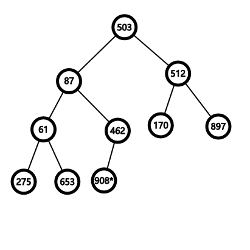
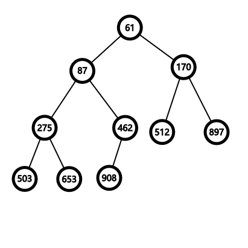
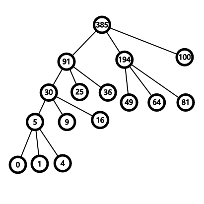

$$
\mathscr{Lorain~wy~Lora~blea.}

\newcommand{\DS}[0]{\displaystyle}

% operators alias
\newcommand{\opn}[1]{\operatorname{#1}}
\newcommand{\card}[0]{\opn{card}}
\newcommand{\lcm}[0]{\opn{lcm}}
\newcommand{\char}[0]{\opn{char}}
\newcommand{\Char}[0]{\opn{Char}}
\newcommand{\Min}[0]{\opn{Min}}
\newcommand{\rank}[0]{\opn{rank}}
\newcommand{\Hom}[0]{\opn{Hom}}
\newcommand{\End}[0]{\opn{End}}
\newcommand{\im}[0]{\opn{im}}
\newcommand{\tr}[0]{\opn{tr}}
\newcommand{\diag}[0]{\opn{diag}}
\newcommand{\coker}[0]{\opn{coker}}
\newcommand{\id}[0]{\opn{id}}
\newcommand{\sgn}[0]{\opn{sgn}}
\newcommand{\Res}[0]{\opn{Res}}
\newcommand{\Ad}[0]{\opn{Ad}}
\newcommand{\ord}[0]{\opn{ord}}
\newcommand{\Stab}[0]{\opn{Stab}}
\newcommand{\conjeq}[0]{\sim_{\u{conj}}}
\newcommand{\cent}[0]{\u{\degree C}}
\newcommand{\Sym}[0]{\opn{Sym}}
\newcommand{\Var}[0]{\opn{Var}}
\newcommand{\wg}[0]{\wedge}
\newcommand{\Wg}[0]{\bigwedge}
\newcommand{\sq}[0]{\opn{\square}}

% symbols alias
\newcommand{\E}[0]{\exist}
\newcommand{\A}[0]{\forall}
\newcommand{\l}[0]{\left}
\newcommand{\r}[0]{\right}
\newcommand{\ox}[0]{\otimes}
\newcommand{\lra}[0]{\leftrightarrow}
\newcommand{\llra}[0]{\longleftrightarrow}
\newcommand{\iso}[1]{\overset{\sim}{#1}}
\newcommand{\eps}[0]{\varepsilon}
\newcommand{\Ra}[0]{\Rightarrow}
\newcommand{\Eq}[0]{\Leftrightarrow}
\newcommand{\d}[0]{\mathrm{d}}
\newcommand{\e}[0]{\mathrm{e}}
\newcommand{\i}[0]{\mathrm{i}}
\newcommand{\j}[0]{\mathrm{j}}
\newcommand{\k}[0]{\mathrm{k}}
\newcommand{\Ex}[0]{\mathbb{E}}
\newcommand{\D}[0]{\mathbb{D}}
\newcommand{\oo}[0]{\infty}
\newcommand{\tto}[0]{\rightrightarrows}
\newcommand{\mmap}[0]{\hookrightarrow}
\newcommand{\emap}[0]{\twoheadrightarrow}
\newcommand{\actl}[0]{\curvearrowright}
\newcommand{\actr}[0]{\curvearrowleft}
\newcommand{\nsubg}[0]{\triangleleft}
\newcommand{\nsupg}[0]{\triangleright}
\newcommand{\lin}[0]{\lim_{n\to\oo}}
\newcommand{\linf}[0]{\liminf_{n\to\oo}}
\newcommand{\lsup}[0]{\limsup_{n\to\oo}}
\newcommand{\ser}[0]{\sum_{n=1}^\oo}
\newcommand{\serz}[0]{\sum_{n=0}^\oo}
\newcommand{\isoto}[0]{\overset\sim\to}
\newcommand{\F}[0]{\mathbb F}
\newcommand{\x}[0]{\times}
\newcommand{\M}[0]{\mathbf{M}}
\newcommand{\T}[0]{\intercal}
\newcommand{\Co}[0]{\complement}
\newcommand{\alp}[0]{\alpha}
\newcommand{\lmd}[0]{\lambda}
\newcommand{\mmid}[0]{\parallel}
\newcommand{\loop}[0]{\circlearrowleft}
\newcommand{\go}[0]{\triangleright}

% symbols with parameters
\newcommand{\der}[1]{\frac{\d}{\d #1}}
\newcommand{\ul}[1]{\underline{#1}}
\newcommand{\ol}[1]{\overline{#1}}
\newcommand{\wt}[1]{\widetilde{#1}}
\newcommand{\br}[1]{\l(#1\r)}
\newcommand{\bk}[1]{\l[#1\r]}
\newcommand{\ev}[1]{\l.#1\r|}
\newcommand{\wh}[1]{\widehat{#1}}
\newcommand{\eval}[1]{\l[\!\l[#1\r]\!\r]}
\newcommand{\abs}[1]{\l|#1\r|}
\newcommand{\bs}[1]{\boldsymbol{#1}}
\newcommand{\dat}[1]{\bs{\mathrm{#1}}}
\newcommand{\env}[2]{\begin{#1}#2\end{#1}}
\newcommand{\ALI}[1]{\env{aligned}{#1}}
\newcommand{\CAS}[1]{\env{cases}{#1}}
\newcommand{\pmat}[1]{\env{pmatrix}{#1}}
\newcommand{\algo}[1]{\begin{array}{r|l}#1\end{array}}
\newcommand{\dary}[2]{\l|\begin{array}{#1}#2\end{array}\r|}
\newcommand{\pary}[2]{\l(\begin{array}{#1}#2\end{array}\r)}
\newcommand{\pblk}[4]{\l(\begin{array}{c|c}{#1}&{#2}\\\hline{#3}&{#4}\end{array}\r)}
\newcommand{\u}[1]{\mathrm{#1}}
\newcommand{\t}[1]{\text{#1}}
\newcommand{\tb}[1]{\textbf{#1}}
\newcommand{\os}[2]{\overset{#1}{#2}}
\newcommand{\lix}[1]{\lim_{x\to #1}}
\newcommand{\ops}[1]{#1\cdots #1}
\newcommand{\seq}[3]{{#1}_{#2}\ops,{#1}_{#3}}
\newcommand{\dedu}[2]{\u{(#1)}\Ra\u{(#2)}}
\newcommand{\prv}[3]{\DS{{\DS #1} \over {\DS #2}}~(#3)}
$$

**1.**

&emsp;&emsp;最终序列为:

```plain
先序: A B C D E F G H I J K
中序: C B E D F A H J K I G
后序: C E F D B K J I H G A
```

树为:



&nbsp;

**2.**

&emsp;&emsp;对树结构归纳.

&emsp;&emsp;(a) 当根是叶子时, 显然成立;

&emsp;&emsp;(b) 当根只有一个孩子, 则对此孩子的子树归纳可知成立;

&emsp;&emsp;(c) 若根节点有左右孩子 $l$, $r$, 各序列总会先枚举完 $l$ 子树中的所有结点, 再进入 $r$ 子树, 所以在三种序列中, $l$ 子树内结点总出现在 $r$ 子树内结点之前. 最后对 $l$ 和 $r$ 子树分别归纳可知成立.

&nbsp;

**3.**

&emsp;&emsp;(1) 根据 Huffman 树的贪心性质, 不可能出现只具有一个孩子的结点, 否则可以删除该结点并将其唯一孩子向其父亲连边, 使得编码仍然合法的条件下变短. 所以
$$
2(n_{\text{total}}-n_{\text{leaf}})+1=n_{\text{total}}=199\Ra n_{\text{leaf}}=100.
$$
&emsp;&emsp;(2) 如图构造 Huffman 树:



不妨设字母为 A~H, 则编码为

| 字母 | 出现概率 |  编码   |
| :--: | :------: | :-----: |
|  A   |  $0.07$  | `0100`  |
|  B   |  $0.19$  |  `10`   |
|  C   |  $0.02$  | `01101` |
|  D   |  $0.06$  | `0111`  |
|  E   |  $0.32$  |  `00`   |
|  F   |  $0.03$  | `01100` |
|  G   |  $0.21$  |  `11`   |
|  H   |  $0.10$  | `0101`  |

&emsp;&emsp;(3) 相较于 Huffman 编码, 使用三位二进制编码的优劣为:

- **优势**
    - 编码映射更简单, 易于实现与验证;
    - 单字编码长度固定, 易于对长电文进行截取, 翻译等处理, 更易纠错;
- **劣势**
    - 编码期望长度更大.

&nbsp;

**4.**

&emsp;&emsp;(1) 第一步, 将序列视作二叉堆, 并从 $n/2=5$ 号结点开始 sift down 调整.



第一次 sift down 后变为



同理, 最后构建出的二叉堆为



&emsp;&emsp;(2) 可能在任何一个叶结点处.

&emsp;&emsp;(3) 在建堆时, 我们依次遍历结点 $n/2$ ("$/$" 除号均指下取整除法) 到 $1$, 进行 sift down 操作. 设叶结点的高度为 $0$, 则对高度为 $h$ 的结点 sift down 至多进行 $h$ 次比较. 因此, 总比较次数的最大值就是 $n$ 个结点的满二叉树的各结点高度之和, 记为 $f(n)$. 可以写出
$$
f(2^1-1)=0,\quad f(2^{w+1}-1)=2f(2^{w}-1)+w.
$$
所以
$$
f(2^{w+1}-1)+(w+1)+1=2(f(2^w-1)+w+1)=2^w(0+1+1)=2^{w+1}\\
\Ra f(2^w-1)=2^w-w-1.
$$
因此 $f(n)=n+\mathcal O(\log n)$, $C_0=1$.

&nbsp;

**5.**

&emsp;&emsp;类似 Huffman 树的构造, 首先在权值集合中补充若干个 $0$ 使得 $m\equiv 1\pmod{k-1}$, 这样总能使非叶结点有 $k$ 个孩子. 维护一个小根堆, 每次从堆中连续取 $k$ 个元素, 新增树结点连向这 $k$ 个元素所代表的结点, 然后把新增结点压入堆, 权值为 $k$ 个元素的权值之和.

&emsp;&emsp;对于题中权值集合, 补充一个 $0$, 对 $[0,1,4,9,16,25,36,49,64,81,100]$ 构造如下:



加权路径长度和为 $705$.