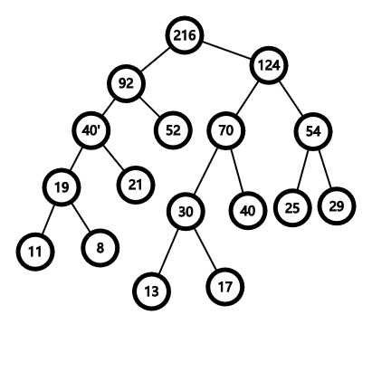

$$
\mathscr{Lorain~wy~Lora~blea.}

\newcommand{\DS}[0]{\displaystyle}

% operators alias
\newcommand{\opn}[1]{\operatorname{#1}}
\newcommand{\card}[0]{\opn{card}}
\newcommand{\lcm}[0]{\opn{lcm}}
\newcommand{\char}[0]{\opn{char}}
\newcommand{\Char}[0]{\opn{Char}}
\newcommand{\Min}[0]{\opn{Min}}
\newcommand{\rank}[0]{\opn{rank}}
\newcommand{\Hom}[0]{\opn{Hom}}
\newcommand{\End}[0]{\opn{End}}
\newcommand{\im}[0]{\opn{im}}
\newcommand{\tr}[0]{\opn{tr}}
\newcommand{\diag}[0]{\opn{diag}}
\newcommand{\coker}[0]{\opn{coker}}
\newcommand{\id}[0]{\opn{id}}
\newcommand{\sgn}[0]{\opn{sgn}}
\newcommand{\Res}[0]{\opn{Res}}
\newcommand{\Ad}[0]{\opn{Ad}}
\newcommand{\ord}[0]{\opn{ord}}
\newcommand{\Stab}[0]{\opn{Stab}}
\newcommand{\conjeq}[0]{\sim_{\u{conj}}}
\newcommand{\cent}[0]{\u{\degree C}}
\newcommand{\Sym}[0]{\opn{Sym}}
\newcommand{\Var}[0]{\opn{Var}}
\newcommand{\wg}[0]{\wedge}
\newcommand{\Wg}[0]{\bigwedge}
\newcommand{\sq}[0]{\opn{\square}}

% symbols alias
\newcommand{\E}[0]{\exist}
\newcommand{\A}[0]{\forall}
\newcommand{\l}[0]{\left}
\newcommand{\r}[0]{\right}
\newcommand{\ox}[0]{\otimes}
\newcommand{\lra}[0]{\leftrightarrow}
\newcommand{\llra}[0]{\longleftrightarrow}
\newcommand{\iso}[1]{\overset{\sim}{#1}}
\newcommand{\eps}[0]{\varepsilon}
\newcommand{\Ra}[0]{\Rightarrow}
\newcommand{\Eq}[0]{\Leftrightarrow}
\newcommand{\d}[0]{\mathrm{d}}
\newcommand{\e}[0]{\mathrm{e}}
\newcommand{\i}[0]{\mathrm{i}}
\newcommand{\j}[0]{\mathrm{j}}
\newcommand{\k}[0]{\mathrm{k}}
\newcommand{\Ex}[0]{\mathbb{E}}
\newcommand{\D}[0]{\mathbb{D}}
\newcommand{\oo}[0]{\infty}
\newcommand{\tto}[0]{\rightrightarrows}
\newcommand{\mmap}[0]{\hookrightarrow}
\newcommand{\emap}[0]{\twoheadrightarrow}
\newcommand{\actl}[0]{\curvearrowright}
\newcommand{\actr}[0]{\curvearrowleft}
\newcommand{\nsubg}[0]{\triangleleft}
\newcommand{\nsupg}[0]{\triangleright}
\newcommand{\lin}[0]{\lim_{n\to\oo}}
\newcommand{\linf}[0]{\liminf_{n\to\oo}}
\newcommand{\lsup}[0]{\limsup_{n\to\oo}}
\newcommand{\ser}[0]{\sum_{n=1}^\oo}
\newcommand{\serz}[0]{\sum_{n=0}^\oo}
\newcommand{\isoto}[0]{\overset\sim\to}
\newcommand{\F}[0]{\mathbb F}
\newcommand{\x}[0]{\times}
\newcommand{\M}[0]{\mathbf{M}}
\newcommand{\T}[0]{\intercal}
\newcommand{\Co}[0]{\complement}
\newcommand{\alp}[0]{\alpha}
\newcommand{\lmd}[0]{\lambda}
\newcommand{\mmid}[0]{\parallel}
\newcommand{\loop}[0]{\circlearrowleft}
\newcommand{\go}[0]{\triangleright}

% symbols with parameters
\newcommand{\der}[1]{\frac{\d}{\d #1}}
\newcommand{\ul}[1]{\underline{#1}}
\newcommand{\ol}[1]{\overline{#1}}
\newcommand{\wt}[1]{\widetilde{#1}}
\newcommand{\br}[1]{\l(#1\r)}
\newcommand{\bk}[1]{\l[#1\r]}
\newcommand{\ev}[1]{\l.#1\r|}
\newcommand{\wh}[1]{\widehat{#1}}
\newcommand{\eval}[1]{\l[\!\l[#1\r]\!\r]}
\newcommand{\abs}[1]{\l|#1\r|}
\newcommand{\bs}[1]{\boldsymbol{#1}}
\newcommand{\dat}[1]{\bs{\mathrm{#1}}}
\newcommand{\env}[2]{\begin{#1}#2\end{#1}}
\newcommand{\ALI}[1]{\env{aligned}{#1}}
\newcommand{\CAS}[1]{\env{cases}{#1}}
\newcommand{\pmat}[1]{\env{pmatrix}{#1}}
\newcommand{\algo}[1]{\begin{array}{r|l}#1\end{array}}
\newcommand{\dary}[2]{\l|\begin{array}{#1}#2\end{array}\r|}
\newcommand{\pary}[2]{\l(\begin{array}{#1}#2\end{array}\r)}
\newcommand{\pblk}[4]{\l(\begin{array}{c|c}{#1}&{#2}\\\hline{#3}&{#4}\end{array}\r)}
\newcommand{\u}[1]{\mathrm{#1}}
\newcommand{\t}[1]{\text{#1}}
\newcommand{\tb}[1]{\textbf{#1}}
\newcommand{\os}[2]{\overset{#1}{#2}}
\newcommand{\lix}[1]{\lim_{x\to #1}}
\newcommand{\ops}[1]{#1\cdots #1}
\newcommand{\seq}[3]{{#1}_{#2}\ops,{#1}_{#3}}
\newcommand{\dedu}[2]{\u{(#1)}\Ra\u{(#2)}}
\newcommand{\prv}[3]{\DS{{\DS #1} \over {\DS #2}}~(#3)}
$$

**1.**

&emsp;&emsp;第一个 runs (不妨以升序列表示堆内部状态, 下划线部分表示堆有效元素):
$$
\{\ul{3,12,15,22,38}\}\to\{\ul{12,15,18,22,38}\}\to\{\ul{15,18,22,38},9\}\to\{\ul{18,22,38},14,9\}\\
\to\{\ul{22,38},11,14,9\}\to\{\ul{28,38},11,14,9\}\to\{\ul{38},23,11,14,9\}\to\{6,23,11,14,9\}\\
\u{Runs}~\#1:[3,12,15,18,22,28,38].
$$
第二个 runs:
$$
\{\ul{6,9,11,14,23}\}\to\{\ul{9,11,14,23,26}\}\to\{\ul{11,14,17,23,26}\}\to\{\ul{14,17,23,26},7\}\to\{7\}\\
\u{Runs}~\#2:[6,9,11,14,17,23,36].
$$
第三个 runs:
$$
\u{Runs}~\#3:[7].
$$
&nbsp;

**2.**

&emsp;&emsp;构造最佳归并树如下:



带权路径长度为 $645$, 每次归并 $a$ 和 $b$ 有 $a+b$ 次读和 $a+b$ 次写, 最终访问次数 $645\x 2=1290$.

&nbsp;

**3.**

&emsp;&emsp;(1)

```plain
    112
   /    \
  47     65
 /  \   /  \
22  25 28  37
   /  \    / \
  12  13  18 19
         / \
        9   9
       / \
      2   7
```

&emsp;&emsp;(2)

```plain
    3
   / \
  7   5
 /
10
```

```plain
    4
   / \
  7   5
 /
10
```

```plain
    5
   / \
  7   9
 /
10
```

```plain
    7
   / \
  10  9
 /
12
```

```plain
    8
   / \
  10  9
 /
12
```

&emsp;&emsp;(3) 败者树在单次更新时需要 $\log_2 n+\mathcal O(1)$ 次比较, 堆最坏则需要 $2\log_2 n+\mathcal O(1)$ 次比较, 败者树的效率更高且数据移动次数更少.