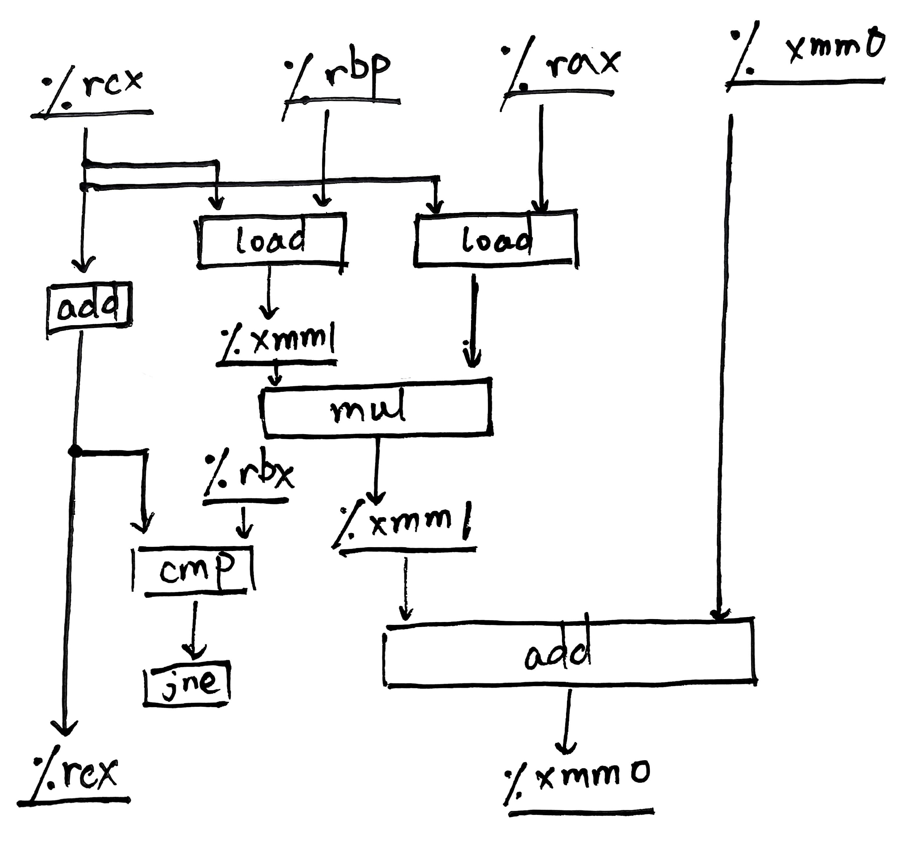

$$
\mathscr{Lorain~wy~Lora~blea.}

\newcommand{\DS}[0]{\displaystyle}

% operators alias
\newcommand{\opn}[1]{\operatorname{#1}}
\newcommand{\card}[0]{\opn{card}}
\newcommand{\lcm}[0]{\opn{lcm}}
\newcommand{\char}[0]{\opn{char}}
\newcommand{\Char}[0]{\opn{Char}}
\newcommand{\Min}[0]{\opn{Min}}
\newcommand{\rank}[0]{\opn{rank}}
\newcommand{\Hom}[0]{\opn{Hom}}
\newcommand{\End}[0]{\opn{End}}
\newcommand{\im}[0]{\opn{im}}
\newcommand{\tr}[0]{\opn{tr}}
\newcommand{\diag}[0]{\opn{diag}}
\newcommand{\coker}[0]{\opn{coker}}
\newcommand{\id}[0]{\opn{id}}
\newcommand{\sgn}[0]{\opn{sgn}}
\newcommand{\Res}[0]{\opn{Res}}
\newcommand{\Ad}[0]{\opn{Ad}}
\newcommand{\ord}[0]{\opn{ord}}
\newcommand{\Stab}[0]{\opn{Stab}}
\newcommand{\conjeq}[0]{\sim_{\u{conj}}}
\newcommand{\cent}[0]{\u{\degree C}}
\newcommand{\Sym}[0]{\opn{Sym}}
\newcommand{\Var}[0]{\opn{Var}}
\newcommand{\wg}[0]{\wedge}
\newcommand{\Wg}[0]{\bigwedge}
\newcommand{\sq}[0]{\opn{\square}}

% symbols alias
\newcommand{\E}[0]{\exist}
\newcommand{\A}[0]{\forall}
\newcommand{\l}[0]{\left}
\newcommand{\r}[0]{\right}
\newcommand{\ox}[0]{\otimes}
\newcommand{\lra}[0]{\leftrightarrow}
\newcommand{\llra}[0]{\longleftrightarrow}
\newcommand{\iso}[1]{\overset{\sim}{#1}}
\newcommand{\eps}[0]{\varepsilon}
\newcommand{\Ra}[0]{\Rightarrow}
\newcommand{\Eq}[0]{\Leftrightarrow}
\newcommand{\d}[0]{\mathrm{d}}
\newcommand{\e}[0]{\mathrm{e}}
\newcommand{\i}[0]{\mathrm{i}}
\newcommand{\j}[0]{\mathrm{j}}
\newcommand{\k}[0]{\mathrm{k}}
\newcommand{\Ex}[0]{\mathbb{E}}
\newcommand{\D}[0]{\mathbb{D}}
\newcommand{\oo}[0]{\infty}
\newcommand{\tto}[0]{\rightrightarrows}
\newcommand{\mmap}[0]{\hookrightarrow}
\newcommand{\emap}[0]{\twoheadrightarrow}
\newcommand{\actl}[0]{\curvearrowright}
\newcommand{\actr}[0]{\curvearrowleft}
\newcommand{\nsubg}[0]{\triangleleft}
\newcommand{\nsupg}[0]{\triangleright}
\newcommand{\lin}[0]{\lim_{n\to\oo}}
\newcommand{\linf}[0]{\liminf_{n\to\oo}}
\newcommand{\lsup}[0]{\limsup_{n\to\oo}}
\newcommand{\ser}[0]{\sum_{n=1}^\oo}
\newcommand{\serz}[0]{\sum_{n=0}^\oo}
\newcommand{\isoto}[0]{\overset\sim\to}
\newcommand{\F}[0]{\mathbb F}
\newcommand{\x}[0]{\times}
\newcommand{\M}[0]{\mathbf{M}}
\newcommand{\T}[0]{\intercal}
\newcommand{\Co}[0]{\complement}
\newcommand{\alp}[0]{\alpha}
\newcommand{\lmd}[0]{\lambda}
\newcommand{\mmid}[0]{\parallel}
\newcommand{\loop}[0]{\circlearrowleft}
\newcommand{\go}[0]{\triangleright}

% symbols with parameters
\newcommand{\der}[1]{\frac{\d}{\d #1}}
\newcommand{\ul}[1]{\underline{#1}}
\newcommand{\ol}[1]{\overline{#1}}
\newcommand{\wt}[1]{\widetilde{#1}}
\newcommand{\br}[1]{\l(#1\r)}
\newcommand{\bk}[1]{\l[#1\r]}
\newcommand{\ev}[1]{\l.#1\r|}
\newcommand{\wh}[1]{\widehat{#1}}
\newcommand{\eval}[1]{\l[\!\l[#1\r]\!\r]}
\newcommand{\abs}[1]{\l|#1\r|}
\newcommand{\bs}[1]{\boldsymbol{#1}}
\newcommand{\dat}[1]{\bs{\mathrm{#1}}}
\newcommand{\env}[2]{\begin{#1}#2\end{#1}}
\newcommand{\ALI}[1]{\env{aligned}{#1}}
\newcommand{\CAS}[1]{\env{cases}{#1}}
\newcommand{\pmat}[1]{\env{pmatrix}{#1}}
\newcommand{\algo}[1]{\begin{array}{r|l}#1\end{array}}
\newcommand{\dary}[2]{\l|\begin{array}{#1}#2\end{array}\r|}
\newcommand{\pary}[2]{\l(\begin{array}{#1}#2\end{array}\r)}
\newcommand{\pblk}[4]{\l(\begin{array}{c|c}{#1}&{#2}\\\hline{#3}&{#4}\end{array}\r)}
\newcommand{\u}[1]{\mathrm{#1}}
\newcommand{\t}[1]{\text{#1}}
\newcommand{\tb}[1]{\textbf{#1}}
\newcommand{\os}[2]{\overset{#1}{#2}}
\newcommand{\lix}[1]{\lim_{x\to #1}}
\newcommand{\ops}[1]{#1\cdots #1}
\newcommand{\seq}[3]{{#1}_{#2}\ops,{#1}_{#3}}
\newcommand{\dedu}[2]{\u{(#1)}\Ra\u{(#2)}}
\newcommand{\prv}[3]{\DS{{\DS #1} \over {\DS #2}}~(#3)}
$$

**1.** (P393 5.13-5.16)

&emsp;&emsp;(13)

&emsp;&emsp;(13-A)



&emsp;&emsp;关键路径: $\t{\%xmm0}\to\t{add}\to\t{\%xmm0}\to\t{add}\to\cdots$.

&emsp;&emsp;(13-B) fp add unit 的 latency bound.

&emsp;&emsp;(13-C) int add unit 的 latency bound.

&emsp;&emsp;(13-D) 乘法数据互不依赖, 可以流水化; 但加法数据前后依赖, 受 latency bound 限制.

&emsp;&emsp;(14)

```c
void inner_6x1(vec_ptr u, vec_ptr v, data_t *dest) {
    long i, length = vec_length(u), limit = n - 5;
    data_t *udata = get_vec_start(u), *vdata = get_vec_start(v);
    data_t sum = 0;
    for (i = 0; i < limit; i += 6) {
        sum = sum + udata[i] * vdata[i] + udata[i + 1] * vdata[i + 1]
                  + udata[i + 2] * vdata[i + 2] + udata[i + 3] * vdata[i + 3]
                  + udata[i + 4] * vdata[i + 4] + udata[i + 5] * vdata[i + 5];
    }
    for (; i < length; i++) {
        sum = sum + udata[i] * vdata[i];
    }
    *dest = sum;
}
```

&emsp;&emsp;(14-A) load $2n$ 个整型或浮点型已经有 $\text{CPE}\ge1.00$.

&emsp;&emsp;(14-B) 所有浮点乘法间无数据依赖, 可以充分填充两个 pipelined fp mult units, 但是 `inner4` 的瓶颈在于浮点加法: 所有加法前后依赖, 所以由 fp add unit 的 latency bound 限制 CPE. `inner_6x1` 还是存在这一问题, 不能带来显著优化.

&emsp;&emsp;(15)

```c
void inner_6x6(vec_ptr u, vec_ptr v, data_t *dest) {
    long i, length = vec_length(u), limit = n - 5;
    data_t *udata = get_vec_start(u), *vdata = get_vec_start(v);
    data_t s0 = 0, s1 = 0, s2 = 0, s3 = 0, s4 = 0, s5 = 0;
    for (i = 0; i < limit; i += 6) {
        s0 = s0 + udata[i] * vdata[i];
        s1 = s1 + udata[i + 1] * vdata[i + 1];
        s2 = s2 + udata[i + 2] * vdata[i + 2];
        s3 = s3 + udata[i + 3] * vdata[i + 3];
        s4 = s4 + udata[i + 4] * vdata[i + 4];
        s5 = s5 + udata[i + 5] * vdata[i + 5];
    }
    for (; i < length; i++) {
        s0 = s0 + udata[i] * vdata[i];
    }
    *dest = s0 + s1 + s2 + s3 + s4 + s5;
}
```

&emsp;&emsp;制约因素: 关键路径外的 cycles, 过大的循环尾项常数等.

&emsp;&emsp;(16)

```c
void inner_6x1a(vec_ptr u, vec_ptr v, data_t *dest) {
    long i, length = vec_length(u), limit = n - 5;
    data_t *udata = get_vec_start(u), *vdata = get_vec_start(v);
    data_t sum = 0;
    for (i = 0; i < limit; i += 6) {
        sum = sum + ((udata[i] * vdata[i] + udata[i + 1] * vdata[i + 1])
                  +  (udata[i + 2] * vdata[i + 2] + udata[i + 3] * vdata[i + 3])
                  +  (udata[i + 4] * vdata[i + 4] + udata[i + 5] * vdata[i + 5]));
    }
    for (; i < length; i++) {
        sum = sum + udata[i] * vdata[i];
    }
    *dest = sum;
}
```

&nbsp;

**2.** (P497 7.6)

|       符号       | $\texttt{swap.o.symtab}$ 条目? | 符号类型 | 定义符号的模块 |     节      |
| :--------------: | :----------------------------: | :------: | :------------: | :---------: |
|  $\texttt{buf}$  |               是               |   外部   | $\texttt{m.o}$ | $\t{.data}$ |
| $\texttt{bufp0}$ |               是               |   全局   |  $\t{swap.o}$  | $\t{.data}$ |
| $\texttt{bufp1}$ |               是               |   局部   |  $\t{swap.o}$  | $\t{.bss}$  |
| $\texttt{swap}$  |               是               |   全局   |  $\t{swap.o}$  | $\t{.text}$ |
| $\texttt{temp}$  |               否               |    /     |       /        |      /      |
| $\texttt{incr}$  |               是               |   局部   |  $\t{swap.o}$  | $\t{.text}$ |
| $\texttt{count}$ |               是               |   局部   |  $\t{swap.o}$  | $\t{.bss}$  |

&nbsp;

**3.** (P498 7.8)

&emsp;&emsp;(A) $\t{DEF(main.1)}$, $\t{DEF(main.2)}$;

&emsp;&emsp;(B) 未知 (只有两个弱符号);

&emsp;&emsp;(C) 错误 (有两个强符号).

&nbsp;

**4.** (P499 7.12)

&emsp;&emsp;(A) $\t{4004f8}+(-\t4)-(\t{4004e0}+\t{a})=\t a$.

&emsp;&emsp;(B) $\t{400500}+(-\t4)-(\t{4004d0}+\t{a})=\t{22}$.

