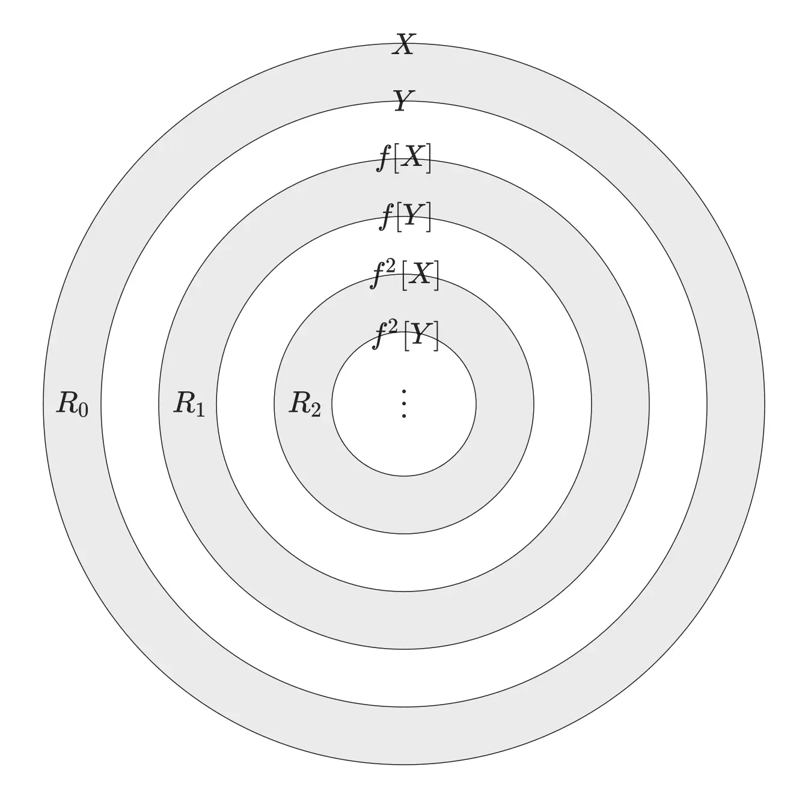

$$
\mathscr{Lorain~wy~Lora~blea.}

\newcommand{\DS}[0]{\displaystyle}

% operators alias
\newcommand{\opn}[1]{\operatorname{#1}}
\newcommand{\card}[0]{\opn{card}}
\newcommand{\lcm}[0]{\opn{lcm}}
\newcommand{\char}[0]{\opn{char}}
\newcommand{\Char}[0]{\opn{Char}}
\newcommand{\Min}[0]{\opn{Min}}
\newcommand{\rank}[0]{\opn{rank}}
\newcommand{\Hom}[0]{\opn{Hom}}
\newcommand{\End}[0]{\opn{End}}
\newcommand{\im}[0]{\opn{im}}
\newcommand{\tr}[0]{\opn{tr}}
\newcommand{\diag}[0]{\opn{diag}}
\newcommand{\coker}[0]{\opn{coker}}
\newcommand{\id}[0]{\opn{id}}
\newcommand{\sgn}[0]{\opn{sgn}}
\newcommand{\Res}[0]{\opn{Res}}
\newcommand{\Ad}[0]{\opn{Ad}}
\newcommand{\ord}[0]{\opn{ord}}
\newcommand{\Stab}[0]{\opn{Stab}}
\newcommand{\conjeq}[0]{\sim_{\u{conj}}}
\newcommand{\cent}[0]{\u{\degree C}}
\newcommand{\Sym}[0]{\opn{Sym}}
\newcommand{\Var}[0]{\opn{Var}}
\newcommand{\wg}[0]{\wedge}
\newcommand{\Wg}[0]{\bigwedge}
\newcommand{\sq}[0]{\opn{\square}}

% symbols alias
\newcommand{\E}[0]{\exist}
\newcommand{\A}[0]{\forall}
\newcommand{\l}[0]{\left}
\newcommand{\r}[0]{\right}
\newcommand{\ox}[0]{\otimes}
\newcommand{\lra}[0]{\leftrightarrow}
\newcommand{\llra}[0]{\longleftrightarrow}
\newcommand{\iso}[1]{\overset{\sim}{#1}}
\newcommand{\eps}[0]{\varepsilon}
\newcommand{\Ra}[0]{\Rightarrow}
\newcommand{\Eq}[0]{\Leftrightarrow}
\newcommand{\d}[0]{\mathrm{d}}
\newcommand{\e}[0]{\mathrm{e}}
\newcommand{\i}[0]{\mathrm{i}}
\newcommand{\j}[0]{\mathrm{j}}
\newcommand{\k}[0]{\mathrm{k}}
\newcommand{\Ex}[0]{\mathbb{E}}
\newcommand{\D}[0]{\mathbb{D}}
\newcommand{\oo}[0]{\infty}
\newcommand{\tto}[0]{\rightrightarrows}
\newcommand{\mmap}[0]{\hookrightarrow}
\newcommand{\emap}[0]{\twoheadrightarrow}
\newcommand{\actl}[0]{\curvearrowright}
\newcommand{\actr}[0]{\curvearrowleft}
\newcommand{\nsubg}[0]{\triangleleft}
\newcommand{\nsupg}[0]{\triangleright}
\newcommand{\lin}[0]{\lim_{n\to\oo}}
\newcommand{\linf}[0]{\liminf_{n\to\oo}}
\newcommand{\lsup}[0]{\limsup_{n\to\oo}}
\newcommand{\ser}[0]{\sum_{n=1}^\oo}
\newcommand{\serz}[0]{\sum_{n=0}^\oo}
\newcommand{\isoto}[0]{\overset\sim\to}
\newcommand{\F}[0]{\mathbb F}
\newcommand{\x}[0]{\times}
\newcommand{\M}[0]{\mathbf{M}}
\newcommand{\T}[0]{\intercal}
\newcommand{\Co}[0]{\complement}
\newcommand{\alp}[0]{\alpha}
\newcommand{\lmd}[0]{\lambda}
\newcommand{\mmid}[0]{\parallel}
\newcommand{\loop}[0]{\circlearrowleft}
\newcommand{\go}[0]{\triangleright}

% symbols with parameters
\newcommand{\der}[1]{\frac{\d}{\d #1}}
\newcommand{\ul}[1]{\underline{#1}}
\newcommand{\ol}[1]{\overline{#1}}
\newcommand{\wt}[1]{\widetilde{#1}}
\newcommand{\br}[1]{\l(#1\r)}
\newcommand{\bk}[1]{\l[#1\r]}
\newcommand{\ev}[1]{\l.#1\r|}
\newcommand{\wh}[1]{\widehat{#1}}
\newcommand{\eval}[1]{\l[\!\l[#1\r]\!\r]}
\newcommand{\abs}[1]{\l|#1\r|}
\newcommand{\bs}[1]{\boldsymbol{#1}}
\newcommand{\dat}[1]{\bs{\mathrm{#1}}}
\newcommand{\env}[2]{\begin{#1}#2\end{#1}}
\newcommand{\ALI}[1]{\env{aligned}{#1}}
\newcommand{\CAS}[1]{\env{cases}{#1}}
\newcommand{\pmat}[1]{\env{pmatrix}{#1}}
\newcommand{\algo}[1]{\begin{array}{r|l}#1\end{array}}
\newcommand{\dary}[2]{\l|\begin{array}{#1}#2\end{array}\r|}
\newcommand{\pary}[2]{\l(\begin{array}{#1}#2\end{array}\r)}
\newcommand{\pblk}[4]{\l(\begin{array}{c|c}{#1}&{#2}\\\hline{#3}&{#4}\end{array}\r)}
\newcommand{\u}[1]{\mathrm{#1}}
\newcommand{\t}[1]{\text{#1}}
\newcommand{\tb}[1]{\textbf{#1}}
\newcommand{\os}[2]{\overset{#1}{#2}}
\newcommand{\lix}[1]{\lim_{x\to #1}}
\newcommand{\ops}[1]{#1\cdots #1}
\newcommand{\seq}[3]{{#1}_{#2}\ops,{#1}_{#3}}
\newcommand{\dedu}[2]{\u{(#1)}\Ra\u{(#2)}}
\newcommand{\prv}[3]{\DS{{\DS #1} \over {\DS #2}}~(#3)}
$$

# 第一章 函数

## $\S1.1$ 实数

> *Tips.*
>
> &emsp;&emsp;看到逻辑的重要性.
>
> &emsp;&emsp;数学定义 $=$ 已知 $+$ 逻辑运算 $\Ra$ something new.

&nbsp;

&emsp;&emsp;无理数集 $\mathbb I$ 用 $\Q$ 的分划来定义.

> **定义 1.1.1 (分划和实数)**
>
> &emsp;&emsp;令 $\Q=A\cup B$, 其中 $A\cap B=\varnothing$ 且 $\A a\in A,~\A b\in B,~a<b$, $B$ 无最小值. 此时称分划 $(A\mid B)$ 是一个实数. 形式地,
> $$
> \R=\{(A\mid B):(A\mid B)\text{ is a partition of }\Q\}.
> $$

可以看出, $(A\mid B)$ 存在两类形式:

- $A$ 存在最大值, 显然 $(A\mid B)\in\Q$;
- $A$ 无最大值, 则它给出了一个所谓的无理数. 例如 $B:=\{r\in\Q : r>0,r^2>2\},~A:=\Q\setminus B\Ra(A\mid B)=:\sqrt2$.

&emsp;&emsp;我们承认, 可以利用有理数集 $A$ 里的已有运算定义出实数 $(A\mid B)$ 的序和四则运算.

> **定理 1.1.2 (Dedekind, 实数的完备性)**
>
> &emsp;&emsp;设 $(E\mid F)$ 为 $\R$ 的一个分划, 则 $E$ 必有最大数.

&emsp;&emsp;*→ Proof.* $(\tilde{A}\mid \tilde{B})$ 为 $\Q$ 的分划, 其中 $\tilde{A}=\bigcup_{(A\mid B)\in E}A$, 那么 $\tilde A=\arg\max E$.

&nbsp;

> **定义 1.1.3 (序数)**
>
> &emsp;&emsp;对集合 $A,B$, 若存在单射 $\varphi:A\to B$, 则称 $|A|\le|B|$. 若存在双射 $\varphi:A\to B$, 则称 $|A|=|B|$.

> **定理 1.1.4 (Schröder-Bernstein)**
>
> &emsp;&emsp;若 $|A|\le|B|$ 且 $|B|\le|A|$, 则 $|A|=|B|$.

&emsp;&emsp;*→ Proof.* $\le$ 的传递性是容易证明的. 此后, 取各自的单射 $f:A\to B$, $g:B\to A$, 则 $h:A\mapsto(g\circ f)(A),~a\mapsto (g\circ f)(a)$ 是 $A$ 与 $h(A)$ 间的双射. 那么现在我们得到了 $|h(A)|\le|g(B)|\le|A|$ 且 $|h(A)|=|A|$, 我们需要证明 "夹在中间" 的 $|g(B)|$ 和两侧的势相等.

&emsp;&emsp;形式地, 我们只需要证明:

> **引理 1.1.5**
>
> &emsp;&emsp;如果集合 $X,Y,Z$ 满足 $Z\sub Y\sub X$ 且 $|X|=|Z|$, 则 $|X|=|Y|$. 

&emsp;&emsp;*→ Proof.*&emsp;设 $f:X\to Z$ 是双射, 那么, 例如, 可以用以下方式给出双射 $g:X\to Y$:
$$
g(x)=\begin{cases}
f(x),&\E n\in\Z_{>0}, x\in f^n(X)\setminus f^n(Y);\\
x,&\text{otherwise}.
\end{cases}
$$
你需要看图:

我们的目标是通过双射 "消除" 最大的灰环. 为此, 我们让所有灰环映射向比自己小一圈的灰环, 所有白环不动, 这样就达成目的了; 最终还会剩下 $\bigcap_{n=0}^\oo f^n(X)$ 和 $\bigcap_{n=0}^\oo f^n(Y)$, 实际上直接取 $f$ 在其上的限制就能得到双射.

> **例子 1.1.6**
>
> &emsp;&emsp;1) $|Q\cap[0,1]|=|\Z_{>0}|$.
>
> &emsp;&emsp;2) $|\mathbb I\cap[0,1]|>|\N|$.
>
> &emsp;&emsp;3) 是否存在 $S\sub[0,1]$, 使得 $|Z_{>0}|<|S|<|[0,1]|$.
>
> &emsp;&emsp;4) $|\mathbb I\cap [0,1]|=|[0,1]|$.
>
> &emsp;&emsp;5) (不加转化地证明) $|\mathbb I\cap[0,1]|\neq|\Z_{>0}|$.
>
> &emsp;&emsp;6) 在 $[0,1]$ 内随机取 $N$ 次数, 求取到有理数的期望个数.

&emsp;&emsp;1), 2) 典; 3) 表述了连续统假设, 是不可证明或证伪的.

&emsp;&emsp;4) 任取一列无理数 $\{s_1,s_2,\cdots\}$, 列出有理数 $\{q_1,q_2,\cdots\}$, 将 $\{s_1,s_2,\cdots\}$ 映到两序列的并, 其余点不变.

&emsp;&emsp;5) 反证, 在二进制小数点后奇数位构造 $\{1,0,1,0,0,1,0,0,0,1,\dots\}$, 偶数位 $k$ 保证与被列出无理数中的第 $k/2$ 个不同即可.

&emsp;&emsp;6) 承认取在 $(a,b)$ 内的概率是 $a-b$, 我们需要证明 $|\Q\cap[0,1]|$ 零测就能说明答案是 $0$. 列出有理数 $\{q_1,q_2,\cdots\}$, 任取 $\delta>0$, 总能用一列长度分别为 $\{\delta\cdot2^{-k}:k=1,2,\dots\}$ 的依次覆盖这些数, 区间总长度是 $\delta\to0$.

## $\S1.3$ 函数的性质

> **定义 1.3.1 (上下界, 上下确界)**
>
> &emsp;&emsp;设 $E\sub\R$, 称 $E$ 有上界, 当且仅当 $\E A\in\R,~\A x\in E,~x\le A$;
>
> &emsp;&emsp;若 $M$ 为 $E$ 的上界, 且 $\A\eps>0,~\E x\in E,~M-\eps<x$, 则 $M$ 为 $E$ 的上确界, 记为 $M=\sup E$.

&emsp;&emsp;例如, $E=\{x:x^2<2\}$, 我们就有 $\sup E=\sqrt 2,~\inf E=-\sqrt 2$. 这里, 我们发现上确界不一定在 $\Q$ 内存在.

> **定理 1.3.2 (确界存在)**
>
> &emsp;&emsp;若非空的 $E\sub\R$ 存在上界, 则 $\sup E$ 在 $\R$ 内存在.

&emsp;&emsp;*→ Proof.* 这和 <u>定理 1.1.2</u> 本质上相同. 取 $(\tilde A\mid\tilde B)$ 为 $\Q$ 的分划, 其中 $\tilde A=\bigcup_{(A\mid B)\in E}A$, 则该分划给出了 $E$ 的上确界.

> **练习 1.3.3** (P22 例 1.3.7)
>
> &emsp;&emsp;若定义在 $\R$ 上的函数 $f$ 有基本周期 $\tau>0$, 且 $\A x\in(0,\tau),~f(0)\neq f(x)$, 则 $g:x\mapsto f(x^2)$ 不是周期函数.

&emsp;&emsp;考虑反证. 如果 $g$ 有周期 $T$, 那么
$$
g(x+T)=f((x+T)^2)=f(x^2+2xT+T^2)=f(x^2)=g(x).
$$
考察 $x=0$ 时的情况,
$$
g(T)=f(T^2)=g(0).
$$
根据条件, 有 $T^2=k\tau~(k\in\Z_{>0})$, 即 $T=\sqrt{k\tau}$. 再令 $x=\sqrt{(k+1)\tau}$ 代入原式,
$$
f\l(\l((2k+1)+2\sqrt{k(k+1)}\r)\tau\r)=f((k+1)\tau)=f(0).
$$
所以, $2\sqrt{k(k+1)}\in\Z$. 不妨设 $(t/2)^2=k(k+1)$, 注意应当有 $k<t/2<k+1$, 所以这样的 $t/2\in\Z$ 是不存在的.

> *Tips.*
>
> &emsp;&emsp;熟悉第一章剩的.

# 第二章 序列的极限

## $\S2.1$ 序列极限的定义

> **定义 2.1.1 (极限)**
>
> &emsp;&emsp;对序列 $\{a_n\}$, $\A\eps>0,~\E N,~\A n\ge N,~|a-a_n|<\eps$, 则称 $a$ 为 $\{a_n\}$ 的极限. 此外, 若 $a=+\oo$, 这里可定义作 $\A M>0,~\E N,~\A n\ge N,~a>M$. $a=-\oo$ 同理.

> **例子 2.1.2**
>
> &emsp;&emsp;验证 $\lim_{n\to\oo}\sqrt[n]{n}=1$.

&emsp;&emsp;*→ Proof.* 取定 $\eps>0$, 希望 $|\sqrt[n]{n}-1|<\eps$, 只需要 $n<(1+\eps)^n\Leftarrow n<\frac{1}{2}n(n-1)\eps^2$, 可得知 $n>\frac{2}{\eps^2}+1$, 相应地任取一个 $N$ 就行.

> **例子 2.1.3**
>
> &emsp;&emsp;若 $\lim_{n\to\oo}a_n=a$, 则 $\DS\lim_{n\to\oo}\frac{a_1+a_2+\cdots+a_n}{n}=a$ ($a=\pm\oo$ 亦成立, 证明稍作修正即可.)

&emsp;&emsp;*→ Proof.* 取定 $\eps>0$, 存在 $N$, 使得 $n\ge N$ 时 $|a_n-a|<\eps$, 那么
$$
\sum_{k=N}^n\frac{a_k-a}{n}<\sum_{k=N}^b\frac{|a_k-a|}{n}<\eps;
$$
另一方面, 根据 $N$, 可以找到 $N'$, 使得 $n\ge N'$ 时,
$$
\sum_{k=1}^{N-1}\frac{a_k}{n}<\eps.
$$
最终取 $N\gets\max\{N,N'\}$, 可知 $\dfrac{a_1+a_2+\cdots+a_n}{n}<2\eps$.

## $\S2.2$ 极限的性质

>**性质 2.2.1**
>
> &emsp;&emsp;若 $\A n\ge n_0,~a_n\le b_n\le c_n$ 且 $\lim_{n\to\oo}a_n=\lim_{n\to\oo}c_n=x$, 则 $\lim_{n\to\oo}b_n=x$.

> **例子 2.2.2**
>
> &emsp;&emsp;证明 $\DS\lim_{n\to\oo}\frac{n^k}{a^n}=0~(k\in\Z_{>0})$.

&emsp;&emsp;*→ Proof.* 当 $n\ge k+1$ 时, 令 $a=1+h~(h>0)$, 那么
$$
0\le\frac{n^k}{(1+h)^n}\le\frac{n^k}{\binom{n}{k+1}h^{k+1}}=\frac{(k+1)!}{\prod_{t=0}^k(1-t/n)\cdot h^{k+1}n}\to 0.
$$

> **性质 2.2.3**
>
> &emsp;&emsp;若 $a_n\to a,b_n\to b$, 那么:
>
> - $a_n\pm b_n\to a\pm b$.
> - $a_nb_n\to ab$.
> - $a_n/b_n\to a/b~(b\neq 0)$.

> **例子 2.2.4**
>
> &emsp;&emsp;1) 求 $\lim_{n\to\oo}a_n$, 其中 $a_n=5n^5-4n^4+3$.
>
> &emsp;&emsp;2) ..., 其中 $a_n=\frac{5n^4+4n^4+9}{n^5+b^3+2}$.
>
> &emsp;&emsp;3) ..., 其中 $a_n=\sin\sqrt{n^2+1}\pi-\sin n\pi$.

&emsp;&emsp;1) $a_n=n^5(5-\frac{4}{n}+\frac{3}{n^5})$, 利用性质即可. 2) 上下除以 $n^5$ 即可.

&emsp;&emsp;3)
$$
a_n=2\cos\frac{\sqrt{n^2+1}+n}{2}\pi\sin\frac{\sqrt{n^2+1}-n}{2}\pi,
$$
而 $\sqrt{n^2+1}-n\to0$, 后一项 $\to0$ 而前一项有界, 所以 $a_n\to 0$.

&nbsp;

> **性质 2.2.5**
>
> - 若 $\{a_n\}$ 收敛, 则其有界.
>
> - 对收敛的 $\{a_n\},\{b_n\}$, 若 $\E N,~\A n>N,~a_n\le b_n$, 那么 $a\le b$. 若 $a<b$, 那么 $\E N,~\A n>N,~a_n<b_n$.
>
> - 若 $\{a_n\}$ 收敛, 则其任意子列收敛于同值.
>
>     $\Ra$ 那么若存在两个子列极限不同, 则原序列不收敛.

## $\S2.3$ 单调收敛原理

> **定理 2.3.1**
>
> &emsp;&emsp;若单调上升的 $\{a_n\}$ 有上界, 则其收敛且 $\lim_{n\to\oo}a_n=\sup_{n\ge 1}a_n=:a$.

&emsp;&emsp;*→ Proof.* 由上确界定义, $\A \eps>0,~\E a_N>a-\eps$, 那么 $\A n\ge N,~a-a_n<\eps$.

&nbsp;

> **例子 2.3.2**
>
> &emsp;&emsp;1) 令 $a_n=(1+\frac{1}{n})^n$, 证明其极限 $e$ 存在.
>
> &emsp;&emsp;2) $e$ 是无理数.

&emsp;&emsp;1) 先说明其单增性,
$$
\begin{aligned}
	a_n&=\sum_{k=0}^n\binom{n}{k}\frac{1}{n^k}\\
	&=1+1+\sum_{k=2}^n\frac{1}{k!}\l(1-\frac{1}{n}\r)\l(1-\frac{2}{n}\r)\cdots\l(1-\frac{k-1}{n}\r).
\end{aligned}
$$
类似地,
$$
a_{n+1}=1+1+\sum_{k=2}^n\frac{1}{k!}\l(1-\frac{1}{n+1}\r)\l(1-\frac{2}{n+1}\r)\cdots\l(1-\frac{k}{n+1}\r)+\l(\frac{1}{n+1}\r)^{n+1}>a_n.
$$
再说明上界存在. 这里直接抄原来的东西啦,
$$
\begin{aligned}
	a_n &= \sum_{k=0}^n\binom{n}{k}\frac{1}{n^k}\\
	&= \sum_{k=0}^n\frac{n!}{k!(n-k)!}\cdot\frac{1}{n^k}\\
	&= \sum_{k=0}^n\frac{1}{k!}\cdot\frac{n!}{(n-k)!n^k}\\
	&\le \sum_{k=0}^n\frac{1}{k!} \le 1+1+\sum_{k=2}^n\frac{1}{2^{k-1}}\\
	&<3.
\end{aligned}
$$
所以极限 $e$ 存在.

&emsp;&emsp;2) 先证明 $\DS e=\lim_{n\to\oo}\l(1+\frac{1}{1!}+\frac{1}{2!}+\cdots+\frac{1}{n!}\r)$. 在刚刚的证明中已有 $e\le\cdots$, 我们需要说明 $e\ge\cdots$. 固定一个 $K\in\N$, 当 $n\ge K$ 时,
$$
a_n\ge1+1+\sum_{k=2}^K\frac{1}{k!}\l(1-\frac{1}{n}\r)\cdots\l(1-\frac{k-1}{n}\r).
$$
使 $n\to\oo$, 左侧为 $e$, 右侧 $\to1+1+\sum_{k=2}^K\frac{1}{k!}$, 再让 $K\to\oo$, 就有 $e\ge\cdots$, 得到目标.

&emsp;&emsp;易裂项放缩证明 $2<e<3$. 接下来, 假设 $e=\frac{q}{p}~(p>1,~p\perp q)$, 则 $p!e=(p-1)!q\in\N$, 即
$$
\begin{aligned}
	p!e&=p!\l(1+\cdots+\frac{1}{p!}+\frac{1}{(p+1)!}+\cdots\r)\\
	&=n_0+p!\l(\frac{1}{(p+1)!}+\cdots\r)\\
	&=n_0+\frac{1}{p+1}+\frac{1}{(p+1)(p+2)}+\cdots\\
	&\in\l(n_0+\frac{1}{p+1},n_0+\frac{2}{p+1}\r),
\end{aligned}
$$
但它一定不是一个整数. (或者, 直接考察一个 $>p$ 的素数也能证明.)

&emsp;&emsp;例如对粘性流体中的弹簧振子, 有
$$
m\ddot x+kx+\gamma\dot x=0.
$$
"尝试" $x=e^{\alpha t}$, 那么
$$
m\alpha^2+\gamma\alpha+k=0
$$
有两根 $\alpha_1,\alpha_2$, 可以写出通解 $x=c_1e^{\alpha_1t}+c_2e^{\alpha_2 t}$ (这能视作一个二维的线性空间), 根据初始条件求出 $c_1,c_2$ 即可.

&emsp;&emsp;*相关探索: Stirling 公式, 第二 Euler 常数.*

## $\S2.4$ 实数连续性的基本定理

> **定理 2.4.1 (Cauchy 收敛原理)**
>
> &emsp;&emsp;实数序列 $\{a_n\}$ 收敛 $\Eq$ $\A\eps>0,~\E N,~\A n,m\ge N,~|a_m-a_n|<\eps$.

&emsp;&emsp;例如 $a_n=\sum_{i=1}^n \frac{\sin i}{i^2}$ 就容易以此说明收敛. 对某个 $\eps>0$,
$$
\begin{aligned}
	|a_{n+p}-a_n| &= \l|\sum_{k=n+1}^{n+p}\frac{\sin k}{k^2}\r|\\
	&\le \sum_{k=n}^{n+p-1}\frac{1}{k(k+1)}\\
	&= \frac{1}{n}-\frac{1}{n+p}\\
	&<\eps.
\end{aligned}
$$
取任意 $N>\frac{1}{\eps}$ 即可.

&emsp;&emsp;我们稍后给出本定理的证明.

&nbsp;

> **定理 2.4.2 (区间套)**
>
> &emsp;&emsp;若有一列 $[a_1,b_1]\supset [a_2,b_2]\supset\cdots$ 且 $b_n-a_n\to 0$, 则
> $$
> \E c\in\R,~\bigcap_{n=1}^\oo[a_n,b_n]=\{c\}.
> $$

&emsp;&emsp;事实上, 还有 $\lin a_n=\lin b_n=c$; 这等价于 Dedekind 定理.

&nbsp;

> **定理 2.4.3 (Bolzano-Weierstrass)**
>
> &emsp;&emsp;若 $\{a_n\}$ 有界, 则 $\{a_n\}$ 存在收敛的子列 $\{a_{n_k}\}_{k=1}^\oo$.

> **定理 2.4.4 (聚点)**
>
> &emsp;&emsp;设 $E\sub\R$, 称 $x_0$ 为 $E$ 的聚点, 当且仅当 $\A \delta>0,U_\circ(x_0,\delta)\cap E\neq\varnothing$. 则有界的无穷点列必有聚点.

&emsp;&emsp;*→ Proof @2.4.3* 似乎原来对它的证明不太聪明. 只需要在 $\{a_n\}$ 的界 $[-M,M]$ 上取区间套, 二分地缩小区间, 每次顺便选出一个元素即可. <u>定理 2.4.3</u> 和 <u>定理 2.4.4</u> 显然是等价的.

&emsp;&emsp;*→ Proof @2.4.1* 左推右平凡. 只说明右推左. 取 $\eps=1$ 可知原数列有界, 则它存在收敛的子列 $\{a_{n_k}\}_{k=1}^\oo\to a$, 下证原序列也收敛到 $a$. 对 $\eps>0$, 在子列中可以取出 $N_1$, 使得 $k>N_1\Ra |a_{n_k}-a|<\frac{\eps}{2}$. 再在原序列取 $N_2$, 使得 $n,m> N_2\Ra |a_n-a_m|<\frac{\eps}{2}$, 最终令 $N=\max\{n_{N_1},N_2\}$, 当 $n>N$ 时, $|a_n-a|<|a_n-a_{n_{N_1}}|+|a_{n_{N_1}}-a|<\eps$.

&nbsp;

> **定理 2.4.5 (压缩映像)**
>
> &emsp;&emsp;若 $f:[a,b]\to[a,b]$ 满足 $|f(x)-f(x')|<q|x-x'|~(0<q<1)$, 则 $\E! x_*\in[a,b],~f(x_*)=x_*$.

&emsp;&emsp;*→ Proof.* 可以直接说明, $\A x\in[a,b],\lin f^n(x)=x_*$ 给出了不动点, 这是因为迭代序列是 Cauchy 列. 唯一性反证就行.

&emsp;&emsp;例如对 $|q|<1$, $x-q\sin x=a\Ra x=a+q\sin x$ 是 $f:x\mapsto q\sin x$ 的不动点, 由此可直接得知该方程有唯一解.

&nbsp;

> **定理 2.4.6 (有限覆盖)**
>
> &emsp;&emsp;设 $\mathcal U=\{U_i=(c_i,d_i)\}_{i\in I}$ 是 $[a,b]$ 的一个开覆盖, 则必有有限的 $J\sub I$, 使得 $\bigcup_{j\in J}U_j\supset[a,b]$.

&emsp;&emsp;*→ Proof.* 反证, 对 $[a,b]$, 二分地取出一个到 $x\in[a,b]$ (这要求了 $[a,b]$ 是闭的) 的区间套, 使得这一族区间都必须被无穷个开区间覆盖. 然而, 必然有一个 $U_k\supset\{x\}$, 它使得套住 $x$ 的无穷多个小区间实际上可以被一个开区间覆盖 (这要求了 $\mathcal U$ 是开区间集), 得到矛盾.

&emsp;&emsp;由此也可以推知 <u>定理 2.4.4</u>, 仍考虑反证, 若不存在聚点, 则能够对每个 $x\in E$ 取出邻域 $U(x,\delta_x)$, $\mathcal U=\bigcup_{x\in E}U(x,\delta_x)$ 是 $[-M,M]$ 的开覆盖, 取出一个有限开覆盖, 则 $E$ 只有有限个点, 矛盾.

&emsp;&emsp;到此可以声明, 至少在 $\R$ 上, 区间套定理, 有限覆盖定理, Weierstrass 定理, 聚点定理是两两等价的; 区间套定理与 Dedekind 定理等价, 而 Cauchy 收敛原理也与它们等价.

&nbsp;

> **定理 2.4.7 (Lebesgue)**
>
> &emsp;&emsp;设 $\mathcal U=\{U_i\}_{i\in I}$ 是 $[a,b]$ 的一个开覆盖, 则 $\E\delta>0,~\A x,x'\in[a,b],~|x-x'|<\delta\Ra\E i\in I,~x,x_i\in U_i$. 称 $\delta$ 为 $\mathcal U$ 的一个 Lebesgue 数.

&emsp;&emsp;*→ Proof.* 考虑 $\mathcal U$ 的有限覆盖的端点升序列为 $\{c_1,c_2,\cdots,c_n\}$, 直接取 $\delta=\min_{i=1}^{n-1}\{c_{i+1}-c_i\}$ 即可.

&emsp;&emsp;或者也可以反证, 对 $\delta=\frac{1}{n}$, $\E x_n,x_n'\in[a,b],~|x_n-x_n'|<\delta\land \not\E U_i\supset\{x_n,x_n'\}$, 则有界的 $\{x_n\}$ 具有收敛的子列, 设其收敛到 $x\in[a,b]$, 显然 $\{x_n'\}$ 也收敛到 $x$. 然而, 必然存在 $U_i\ni x$, 它明显导致假设矛盾.

## $\S2.5$ 上下极限

> **定义 2.5.1 (上下极限)**
>
> &emsp;&emsp;对 $\{a_n\}$, 设 $|a_n|\le M$, 令
> $$
> h_n=\sup_{k\ge n}\{a_k\},\quad\ell_n=\inf_{k\ge n}\{a_k\}.
> $$
> 并定义
> $$
> \lsup a_n=\lin h_n,\quad\linf a_n=\lin\ell_n.
> $$
> 为 $\{a_n\}$ 的上, 下极限.

&emsp;&emsp;由于 $-M\le\ell_n\le a_n\le h_n\le M$ 而 $\{h_n\}$ 单减, $\{\ell_n\}$ 单增, 所以这两个序列都存在极限. 显然, 若 $\lin a_n=a$, 必然有 $\lsup a_n=\linf a_n=a$.

> **例子 2.5.2**
>
> &emsp;&emsp;1) 若 $\{a_n\}$ 有下界且 $a_{n+m}\le a_n+a_m$, 则 $\lin a_n/n$ 存在.
>
> &emsp;&emsp;2) $\lin\sin n$ 不存在.

&emsp;&emsp;(例如, $a_n=\log\|A^n\|$, 则 $\lin a_n/n=\max\{\|\lambda\|:\lambda\text{ is a char of }A\}$.)

&emsp;&emsp;*→ Proof.* 1) 任取 $p\in\Z_{\ge 1}$, 对 $n=kp+r~(0\le r<p)$, 不妨 $a_0=0$, 则
$$
a_n=a_{kp+r}\le a_{kp}+a_r\le ka_p+a_r\\
\Ra \frac{a_n}{n}\le\frac{ka_p}{kp+r}+\frac{a_r}{n}\to\frac{a_p}{p}.
$$
因此
$$
\lsup\frac{a_n}{n}\le\frac{a_p}{p}\quad(\A p\in\Z_{\ge 1})\\
\Ra\lsup\frac{a_n}{n}\le\inf_{p\ge 1}\l\{\frac{a_p}{p}\r\}\le\liminf_{p\to\oo}\frac{a_p}{p}.
$$
最终就有
$$
\lsup\frac{a_n}{n}=\linf\frac{a_n}{n}=\lin a_n.
$$
&emsp;&emsp;2) 由于 $\frac{\pi}{2}>1$, 那么 $[2k\pi+\frac{\pi}{4},2k\pi+\frac{3\pi}{4}]$ 里有无穷个自然数, 它们的 $\sin\ge\frac{\sqrt 2}{2}$, 因此 $\lsup\sin n\ge\frac{\sqrt 2}{2}$. 同理, 最终可知上下极限不相等, 所以极限不存在.

&nbsp;

> **定理 2.5.3**
>
> &emsp;&emsp;1) $\lsup-a_n=-\linf a_n$.
>
> &emsp;&emsp;2)
> $$
> \linf a_n+\linf b_n\le\linf(a_n+b_n)\\\le\linf a_n+\lsup b_n\le\lsup(a_n+b_n)\\\le\lsup a_n+\lsup b_n.
> $$
> &emsp;&emsp;3) 对 $\{a_n\}$, 存在一个子列, 使得
> $$
> \lim_{k\to\oo}a_{n_k}=\lsup a_n.
> $$

&emsp;&emsp;关于 2), 形如 $\inf\{a_n,a_{n+1},\cdots\}+\inf\{b_n,b_{n+1},\cdots\}\le\inf\{a_n+b_n,\cdots\}$ 地研究即可.

&nbsp;

> **例子 2.5.4**
>
> &emsp;&emsp;固定 $\lambda\ge 2$, 若 $y_n=x_n+\lambda x_{n+1}$, 则 $\lin x_n$ 存在等价于 $\lin y_n$ 存在.

&emsp;&emsp;右推左是显然的, 讨论左推右. 先说明 $x_n$ 有界. 由于 $|y_n|\le M$, 又 $|x_n|\le M\Ra |x_{n+1}|=\frac{|y_n-x_n|}{\lambda}\le M$, 所以 $\{x_n\}$ 有界, 上下极限存在. 由 $x_n=y_n-\lambda x_{n+1}$ 得, $h=\lsup(y_n-\lambda x_n)=y-\lambda\ell$, 下极限也有 $\ell=y-\lambda h$, 所以只能 $h=\ell$, 极限存在.

