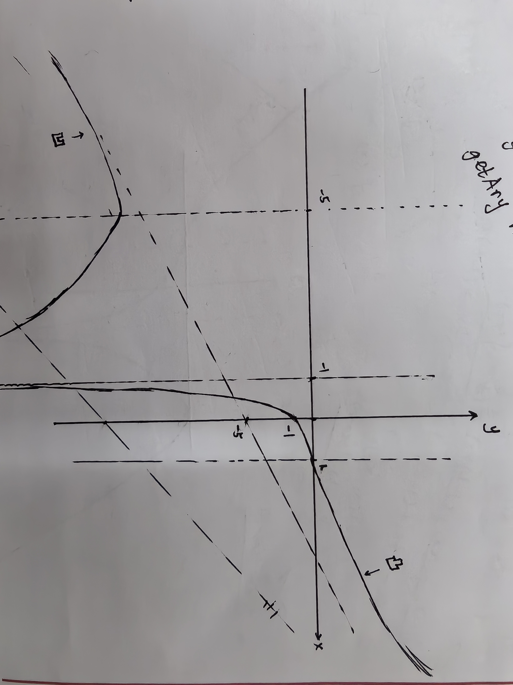

$$
\mathscr{Lorain~wy~Lora~blea.}

\newcommand{\DS}[0]{\displaystyle}

% operators alias
\newcommand{\opn}[1]{\operatorname{#1}}
\newcommand{\card}[0]{\opn{card}}
\newcommand{\lcm}[0]{\opn{lcm}}
\newcommand{\char}[0]{\opn{char}}
\newcommand{\Char}[0]{\opn{Char}}
\newcommand{\Min}[0]{\opn{Min}}
\newcommand{\rank}[0]{\opn{rank}}
\newcommand{\Hom}[0]{\opn{Hom}}
\newcommand{\End}[0]{\opn{End}}
\newcommand{\im}[0]{\opn{im}}
\newcommand{\tr}[0]{\opn{tr}}
\newcommand{\diag}[0]{\opn{diag}}
\newcommand{\coker}[0]{\opn{coker}}
\newcommand{\id}[0]{\opn{id}}
\newcommand{\sgn}[0]{\opn{sgn}}
\newcommand{\Res}[0]{\opn{Res}}
\newcommand{\Ad}[0]{\opn{Ad}}
\newcommand{\ord}[0]{\opn{ord}}
\newcommand{\Stab}[0]{\opn{Stab}}
\newcommand{\conjeq}[0]{\sim_{\u{conj}}}
\newcommand{\cent}[0]{\u{\degree C}}
\newcommand{\Sym}[0]{\opn{Sym}}
\newcommand{\Var}[0]{\opn{Var}}
\newcommand{\wg}[0]{\wedge}
\newcommand{\Wg}[0]{\bigwedge}
\newcommand{\sq}[0]{\opn{\square}}

% symbols alias
\newcommand{\E}[0]{\exist}
\newcommand{\A}[0]{\forall}
\newcommand{\l}[0]{\left}
\newcommand{\r}[0]{\right}
\newcommand{\ox}[0]{\otimes}
\newcommand{\lra}[0]{\leftrightarrow}
\newcommand{\llra}[0]{\longleftrightarrow}
\newcommand{\iso}[1]{\overset{\sim}{#1}}
\newcommand{\eps}[0]{\varepsilon}
\newcommand{\Ra}[0]{\Rightarrow}
\newcommand{\Eq}[0]{\Leftrightarrow}
\newcommand{\d}[0]{\mathrm{d}}
\newcommand{\e}[0]{\mathrm{e}}
\newcommand{\i}[0]{\mathrm{i}}
\newcommand{\j}[0]{\mathrm{j}}
\newcommand{\k}[0]{\mathrm{k}}
\newcommand{\Ex}[0]{\mathbb{E}}
\newcommand{\D}[0]{\mathbb{D}}
\newcommand{\oo}[0]{\infty}
\newcommand{\tto}[0]{\rightrightarrows}
\newcommand{\mmap}[0]{\hookrightarrow}
\newcommand{\emap}[0]{\twoheadrightarrow}
\newcommand{\actl}[0]{\curvearrowright}
\newcommand{\actr}[0]{\curvearrowleft}
\newcommand{\nsubg}[0]{\triangleleft}
\newcommand{\nsupg}[0]{\triangleright}
\newcommand{\lin}[0]{\lim_{n\to\oo}}
\newcommand{\linf}[0]{\liminf_{n\to\oo}}
\newcommand{\lsup}[0]{\limsup_{n\to\oo}}
\newcommand{\ser}[0]{\sum_{n=1}^\oo}
\newcommand{\serz}[0]{\sum_{n=0}^\oo}
\newcommand{\isoto}[0]{\overset\sim\to}
\newcommand{\F}[0]{\mathbb F}
\newcommand{\x}[0]{\times}
\newcommand{\M}[0]{\mathbf{M}}
\newcommand{\T}[0]{\intercal}
\newcommand{\Co}[0]{\complement}
\newcommand{\alp}[0]{\alpha}
\newcommand{\lmd}[0]{\lambda}
\newcommand{\mmid}[0]{\parallel}
\newcommand{\loop}[0]{\circlearrowleft}
\newcommand{\go}[0]{\triangleright}

% symbols with parameters
\newcommand{\der}[1]{\frac{\d}{\d #1}}
\newcommand{\ul}[1]{\underline{#1}}
\newcommand{\ol}[1]{\overline{#1}}
\newcommand{\wt}[1]{\widetilde{#1}}
\newcommand{\br}[1]{\l(#1\r)}
\newcommand{\bk}[1]{\l[#1\r]}
\newcommand{\ev}[1]{\l.#1\r|}
\newcommand{\wh}[1]{\widehat{#1}}
\newcommand{\eval}[1]{\l[\!\l[#1\r]\!\r]}
\newcommand{\abs}[1]{\l|#1\r|}
\newcommand{\bs}[1]{\boldsymbol{#1}}
\newcommand{\dat}[1]{\bs{\mathrm{#1}}}
\newcommand{\env}[2]{\begin{#1}#2\end{#1}}
\newcommand{\ALI}[1]{\env{aligned}{#1}}
\newcommand{\CAS}[1]{\env{cases}{#1}}
\newcommand{\pmat}[1]{\env{pmatrix}{#1}}
\newcommand{\algo}[1]{\begin{array}{r|l}#1\end{array}}
\newcommand{\dary}[2]{\l|\begin{array}{#1}#2\end{array}\r|}
\newcommand{\pary}[2]{\l(\begin{array}{#1}#2\end{array}\r)}
\newcommand{\pblk}[4]{\l(\begin{array}{c|c}{#1}&{#2}\\\hline{#3}&{#4}\end{array}\r)}
\newcommand{\u}[1]{\mathrm{#1}}
\newcommand{\t}[1]{\text{#1}}
\newcommand{\tb}[1]{\textbf{#1}}
\newcommand{\os}[2]{\overset{#1}{#2}}
\newcommand{\lix}[1]{\lim_{x\to #1}}
\newcommand{\ops}[1]{#1\cdots #1}
\newcommand{\seq}[3]{{#1}_{#2}\ops,{#1}_{#3}}
\newcommand{\dedu}[2]{\u{(#1)}\Ra\u{(#2)}}
\newcommand{\prv}[3]{\DS{{\DS #1} \over {\DS #2}}~(#3)}
$$

**1.** (例 5.4.11)

&emsp;&emsp;设 $f(x)=x^{1/p}~(x>0)$, 则
$$
f'(x)=\frac{1}{p}x^{(1-p)/p},\quad f''(x)=\frac{1-p}{p^2}x^{(1-2p)/p}.
$$
明显 $p>1$, 所以 $f''(x)<0$, $f(x)$ 在 $(0,+\oo)$ 上凸. 对一组 $t_1\ops,t_n>0$, $\sum t_k=1$, 有
$$
\sum_{i=1}^nt_if(x_i)\le f\br{\sum_{i=1}^n t_ix_i}
\Ra \sum_{i=1}^n t_ix_i^{1/p}\le\l(\sum_{i=1}^n t_ix_i\r)^{1/p}.
$$
现对给定的 $\{a_n\}$, $\{b_n\}$, 构造地, 令
$$
x_i=\frac{a_i^p}{b_i^q},\quad t_i=\frac{b_i^q}{\sum_{i=1}^nb_i^q},
$$
代入得h
$$
\frac{\sum_{i=1}^n a_ib_i^{q-q/p}}{\sum_{i=1}^n b_i^q}\le\l(\frac{\sum_{i=1}^n a_i^p}{\sum_{i=1}^nb_i^q}\r)^{1/p}\Eq\sum_{i=1}^na_ib_i\le\l(\sum_{i=1}^n a_i^p\r)^{1/p}\l(\sum_{i=1}^n b_i^q\r)^{1/q}.
$$
**Supplementary.**

&emsp;&emsp;**Minkowski 不等式**:
$$
\br{\sum_{i=1}^n|x_i+y_i|^p}^{\frac{1}{p}}\le\br{\sum_{i=1}^n|x_i|^p}^{\frac{1}{p}}+\br{\sum_{i=1}^n|y_i|^p}^{\frac{1}{p}}.
$$
这给出了 $\|\cdot\|_p$ 的三角不等式, 允许其成为 $\R^n$ 上的范数.

&emsp;&emsp;*→ Proof.* 取 $q>1$ 使得 $1/p+1/q=1$, $z_{1..n}$ 待定. 题中不等式给出
$$
\sum_{i=1}^nx_iz_i\le\br{\sum_{i=1}^nx_i^p}^{\frac{1}{p}}\br{\sum_{i=1}^nz_i^q}^{\frac{1}{q}},\\
\sum_{i=1}^ny_iz_i\le\br{\sum_{i=1}^ny_i^p}^{\frac{1}{p}}\br{\sum_{i=1}^nz_i^q}^{\frac{1}{q}}.
$$
相加得
$$
\br{\sum_{i=1}^n|x_i|^p}^{\frac{1}{p}}+\br{\sum_{i=1}^n|y_i|^p}^{\frac{1}{p}}\ge\sum_{i=1}^n(x_i+y_i)z_i.
$$
因此可以取
$$
z_i=(x_i+y_i)^{p-1},
$$
代入整理即得目标.

&nbsp;

**2.** (习题五 63)

&emsp;&emsp;由于 $f''$ 存在, 因而
$$
\env{aligned}{
	(\ln f(x))'' &= \l(\frac{f'(x)}{f(x)}\r)'\\
	&= \frac{f''(x)f(x)-(f')^2(x)}{f^2(x)}
}
$$
存在, 那么 $f$ 下凸当且仅当 $(\ln f(x))''\ge 0$, 也就是 $f''(x)f(x)-(f')^2(x)\ge 0$, 即行列式条件.

&nbsp;

**3.** (习题五 64)

&emsp;&emsp;不妨认为 $a,b\ge0$, 省略绝对值. 令 $f(x)=x^p~(x>0)$, 则 $f'(x)=px^{p-1}$, $f''(x)=p(p-1)x^{p-2}$, 讨论:

&emsp;&emsp;(1) $p>1$, 此时 $f''(x)>0$, $f$ 下凸, 所以
$$
\frac{1}{2}f(a)+\frac{1}{2}f(b)\ge f\br{\frac{a+b}{2}}\\
\Ra a^p+b^p\ge 2^{1-p}(a+b)^p.
$$
&emsp;&emsp;(2) $0<p<1$, 此时 $f''(x)<0$, $f$ 上凸, 类似地
$$
\frac{1}{2}f(a)+\frac{1}{2}f(b)\le f\br{\frac{a+b}{2}}\\
\Ra a^p+b^p\le 2^{1-p}(a+b)^p.
$$
&nbsp;

**4.** (习题五 66)

&emsp;&emsp;(1) 不妨只说明 $f_-'(x_0)$ 存在. 任取一列 $(a,b)\supset\{x_n\}\uparrow x_0$, 记 $k_n=\frac{f(x)-f(x_0)}{x_0-x_n}$. 利用凸性的等价刻画, 有 $\{k_n\}$ 单增, 同时取 $0<h_0<b-x_0$ 则有 $k_n\le\frac{f(x_0+h_0)-f(x_0)}{h_0}$, 因此 $\{k_n\}$ 单增有上界, 则其有极限 $k_0$. 而如果另一列 $\{x_n'\}$ 及其对应的 $\{k_n'\}$ 的极限 $k_0'\neq k_0$, 不妨 $k_0'<k_0$, 则能取出足够大的 $n,m$, 使得 $x_n<x_m'$ 但是 $k_n>k_m'$, 矛盾; 所有 $\{k_n\}$ 收敛于同一 $k_0$. 所以 $f'_-(x)$ 存在. 据此可知 $f$ 在 $x_0$ 处连续.

&emsp;&emsp;(2) 在 (1) 中已给出, 任给 $0<h_0<b-x_0$, 均有 $f_-'(x_0)\le\frac{f(x_0+h_0)-f(x_0)}{h_0}$, 这足够说明 $f'_-(x_0)\le f'_+(x_0)$.

&emsp;&emsp;(3) 仍只说明 $f'_-(x)$ 单增. 对任意 $a<x_1<x_2<b$, 根据 (1) 中 $h_0$ 的任意性和 $k_n$ 的单增性,
$$
f'_-(x_1)\le\frac{f(x_1)-f(x_2)}{x_1-x_2}\le f'_-(x_2).
$$

---

**5.** (例 5.4.10)

&emsp;&emsp;容易验证 $f$ 在 $\R$ 上连续. 当 $x\neq 0$, 研究 $\ln f(x)$ 的导数:
$$
(\ln f(x))'=\frac{1}{x^2}\br{x\frac{a_1^x\ln a_1\ops+a_n^x\ln a_n}{a_1^x\ops+a_n^x}-\ln\frac{a_1^x\ops+a_n^x}{n}}.
$$
希望 $(\ln f(x))'>0$, 也即是
$$
a_1^x\ln a_1^x\ops+a_n^x\ln a_n^x>(a_1^x\ops+a_n^x)\ln\frac{a_1^x\ops+a_n^x}{n}.
$$
令 $g(u)=u\ln u~(u>0)$, 则 $g'(u)=1+\ln u$, $g''(u)=1+\frac{1}{u}>0$, $g$ 在 $(0,+\oo)$ 是严格下凸的. 此外, $a_k^x$ 不完全相等, 所以
$$
\frac{1}{n}(g(a_1^x)\ops+g(a_n^x))>\frac{a_1^x\ops+a_n^x}{n}\ln\frac{a_1^x\ops+a_n^x}{n}.
$$
由此可知 $(\ln f(x))'=f'(x)/f(x)>0$, 同时 $f(x)>0$, 所以 $f'(x)>0$, $f$ 在 $\R$ 上严格单增.

&nbsp;

**6.** (例 5.4.13)

&emsp;&emsp;$f(x)=\frac{(x-1)^3}{(x+1)^2}$, 定义域 $\R\setminus\{-1\}$, 其导数
$$
f'(x)=\frac{(x-1)^2(x+5)}{(x+1)^3},\quad f''(x)=\frac{24(x-1)}{(x+1)^4}.
$$
因此分析有

|          |      $(-\oo,-5)$      |     $-5$      |        $(-5,-1)$        | $-1$ |       $(-1,1)$        |   $1$   |      $(1,+\oo)$       |
| :------: | :-------------------: | :-----------: | :---------------------: | :--: | :-------------------: | :-----: | :-------------------: |
| $f''(x)$ |          $-$          |      $-$      |           $-$           |  /   |          $-$          |   $0$   |          $+$          |
| $f'(x)$  |   $+$, $\downarrow$   |      $0$      |    $-$, $\downarrow$    |  /   |   $+$, $\downarrow$   |   $0$   |    $+$, $\uparrow$    |
|  $f(x)$  | $-$, $\uparrow$, 上凸 | $-13.5$, 极大 | $-$, $\downarrow$, 上凸 |  /   | $-$, $\uparrow$, 上凸 | $0$, 拐 | $+$, $\uparrow$, 下凸 |

求极限得 $f(x)$ 有渐近线 $y=x-5$. 最终作出 (请忽略乱入字符; 注意横纵坐标单位长度并不相同; $x\to+\oo$ 应逼近渐近线, 图中不明显):

---

**Supplementary.**

&emsp;&emsp;**定义.** 级数的收敛半径
$$
R:=\frac{1}{\lsup\sqrt[n]{a_n}},\quad (1/0=\oo,~1/\oo=0.)
$$
则当且仅当 $|x|<R$ 时级数收敛; 且

&emsp;&emsp;(1) 对 $0<r<R$, 级数对 $x\in[-r,r]$ 一致收敛 (对 $|a_nx^n|\le (r/R)^n$ 使用 Weiestrass 判别法).

&emsp;&emsp;(2) 级数在 $(-R,R)$ 上连续.

&emsp;&emsp;(3) $f$ 在 $(-R,R)$ 上可导, 且可由形式导数给出结果.

&emsp;&emsp;对于 (3), 只需说明 $\delta\to0$ 时, $\frac{(x+\delta)^n-x^n}{\delta}$ 一致收敛到 $nx^{n-1}$. 当然, 设 $\u Df=g$, 也可以直接证明
$$
f'(x)-g(x)=0\Eq\lim_{\delta\to0}\sum_{n=0}^\oo a_n\br{\frac{(x+\delta)^n-x^n}{\delta}-nx^{n-1}}=0.
$$
Lagrange 余项给出
$$
(x+\delta)^n=x^n+\delta nx^{n-1}+\frac{n(n-1)\xi^{n-2}\delta^2}{2}.
$$
这给出
$$
\abs{\frac{(x+\delta)^n-x^n}{\delta}-nx^{n-1}}\le\delta\frac{n(n-1)(x+\delta)^{n-2}}{2}.
$$
因此有估计
$$
\lim_{\delta\to0}\sum_{n=0}^\oo \abs{a_n\br{\frac{(x+\delta)^n-x^n}{\delta}-nx^{n-1}}}\le\lim_{\delta\to0}\delta\sum_{n=1}^\oo|a_nn(n-1)(x+\delta)^{n-2}|.
$$
再证明和式内部一致有界即可.

&emsp;&emsp;**定义.** $f:(a,b)\to\R$ 称为在 $x$ 处解析, 当且仅当
$$
\E\{c_n\},~\E\delta>0,~\A|t|<\delta,~f(x+t)=\sum_{n=0}^\oo c_nt^n.
$$
那么立即有:

&emsp;&emsp;(1) $f$ 在 $x$ 处解析 $\Ra$ 存在 $\delta>0$, 使得 $f\in C^\oo(x-\delta,x+\delta)$, 且 $c_n=\frac{f^{(n)}(x)}{n!}$.

&emsp;&emsp;(2) 若 $f,g$ 在 $x$ 处解析, 那么 $f\pm g$ 也在 $x$ 处解析. 关于 $f\cdot g$ 其实也成立.

&emsp;&emsp;(3) 若 $g$ 在 $x_0$ 处解析且 $g(x_0)\neq 0$, 则 $\frac{1}{g}$ 在 $x_0$ 处解析. \[这可以作为 (4) 的推论.\]

&emsp;&emsp;(4) 若 $f$ 在 $x_0$ 处解析, $g$ 在 $f(x_0)$ 处解析, 则 $g\circ f$ 在 $x_0$ 处解析.

&emsp;&emsp;(5) 若 $f$ 解析, $f(0)=0$, 则
$$
\env{cases}{
	\frac{f(x)}{x},&x\neq 0;\\
	f'(0),&x=0
}
$$
解析.

&emsp;&emsp;(可参考 preview 中的 <u>级数形式的 Funibi 定理</u> 及相关内容):

> **S1.**
>
> &emsp;&emsp;(1) 设 $\sum_{n=1}^\oo|a_n|<\oo$, $\sum_{n=1}^\oo|b_n|<\oo$, 证明
> $$
> \sum_{n=2}^\oo\abs{\sum_{k=1}^{n-1}a_kb_{n-k}}<\oo,
> $$
> 且
> $$
> \sum_{n=2}^\oo\br{\sum_{k=1}^{n-1}a_kb_{n-k}}=\sum_{n=1}^\oo a_n\sum_{n=1}^\oo b_n.\quad(*)
> $$
> &emsp;&emsp;(2) 设 $\sum_{n=1}^\oo|a_n|<\oo$ 且 $\sum_{n=1}^\oo b_n$ 收敛, 证明 $(*)$ 仍成立.

&emsp;&emsp;

&nbsp;

> **S2.**
>
> &emsp;&emsp;(1) 设 $a_{mn}\ge 0$, 证明
> $$
> \sum_{m=1}^\oo\sum_{n=1}^\oo a_{mn}=\sum_{n=1}^\oo\sum_{m=1}^\oo a_{mn}.\quad(*)
> $$
> &emsp;&emsp;(2) 设 $\sum_{m=1}^\oo\sum_{n=1}^\oo|a_{mn}|<\oo$, 证明 $(*)$ 仍成立.

> **S3.**
>
> &emsp;&emsp;设 $f:(a,b)\to\R$ 处处解析, 求证:
>
> &emsp;&emsp;(1) 若 $f^{-1}(0)$

&emsp;&emsp;(2) 在 $x_0$ 处解析且 $\A k,~f^{(k)}(x_0)=0$ 可推出 $\E\delta>0,~f|_{(x_0-\delta,x_0+\delta)}=0$. 考虑 $A:=\{x\in[x_0,b):f|_{[x_0.x)}=0\}$, 只需证明 $A=[x_0,b]$.

&nbsp;

> **S5.**
>
> &emsp;&emsp;定义 Bernoulli 数 $B_n:=\l.\frac{\d^n}{\d x^n}\frac{x}{e^x-1}\r|_{x=0}$, 证明
>
> &emsp;&emsp;(1) $B_1=-\frac{1}{2}$, $B_{2n+1}=0$.
>
> &emsp;&emsp;(2) 对 $n\ge 2$, 有 $\sum_{k=0}^{n-1}\binom{n}{k}B_k=0$.
>
> &emsp;&emsp;(3) 对 $k\in\N$ 和 $n\in\N$ 有 $1^k\ops+n^k=\frac{1}{k+1}\sum_{j=0}^{k}\binom{k+1}{j+1}B_{k-j}(n+1)^j$.

&emsp;&emsp;(3)
$$
1^k\ops+n^k=k![z^k]\sum_{i=0}^ne^{iz}=k![z^k]\frac{e^{(n+1)z}-1}{e^z-1}.
$$
直接提取系数即可.

&nbsp;

> **S6.**
>
> &emsp;&emsp;设 $f\in C^\oo(\R)$ 满足1 $f^{(k)}\ge 0$, 证明:
>
> &emsp;&emsp;(1) $\A a<b.~\E M>0,~\A k\ge 0,~\sup_{x\in[a,b]}|f^{(k)}(x)|\le M^{k+1}k!$.
>
> &emsp;&emsp;(2) $\A x,y\in R,~f(x)=\sum_{n=0}^\oo\frac{f^{(n)}(x)}{n!}(x-y)^n$.

&emsp;&emsp;(1) 考虑
$$
f(x+t)=\sum_{n=0}^k\frac{f^{(n)}(x)}{n!}t^n+\frac{f^{(k+1)}(\xi)}{(k+1)!}t^{k+1}\ge\frac{f^{(k)}(x)}{k!}t^k.
$$
取 $M=\sup_{x\in[a,b+1]}|f|$ 以及 $t=1$ 即可.
