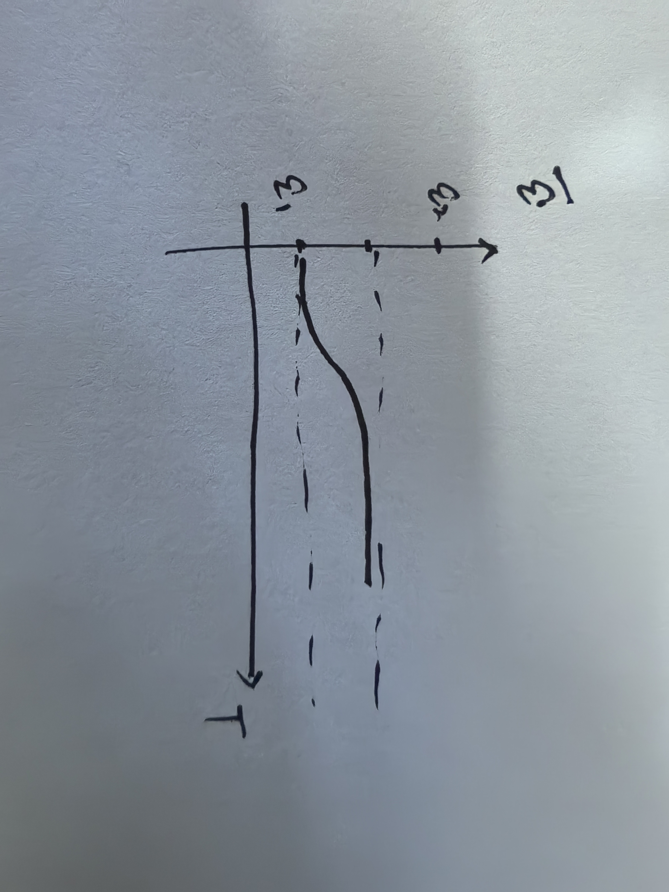

$$
\mathscr{Lorain~wy~Lora~blea.}

\newcommand{\DS}[0]{\displaystyle}

% operators alias
\newcommand{\opn}[1]{\operatorname{#1}}
\newcommand{\card}[0]{\opn{card}}
\newcommand{\lcm}[0]{\opn{lcm}}
\newcommand{\char}[0]{\opn{char}}
\newcommand{\Char}[0]{\opn{Char}}
\newcommand{\Min}[0]{\opn{Min}}
\newcommand{\rank}[0]{\opn{rank}}
\newcommand{\Hom}[0]{\opn{Hom}}
\newcommand{\End}[0]{\opn{End}}
\newcommand{\im}[0]{\opn{im}}
\newcommand{\tr}[0]{\opn{tr}}
\newcommand{\diag}[0]{\opn{diag}}
\newcommand{\coker}[0]{\opn{coker}}
\newcommand{\id}[0]{\opn{id}}
\newcommand{\sgn}[0]{\opn{sgn}}
\newcommand{\Res}[0]{\opn{Res}}
\newcommand{\Ad}[0]{\opn{Ad}}
\newcommand{\ord}[0]{\opn{ord}}
\newcommand{\Stab}[0]{\opn{Stab}}
\newcommand{\conjeq}[0]{\sim_{\u{conj}}}
\newcommand{\cent}[0]{\u{\degree C}}
\newcommand{\Sym}[0]{\opn{Sym}}
\newcommand{\Var}[0]{\opn{Var}}
\newcommand{\wg}[0]{\wedge}
\newcommand{\Wg}[0]{\bigwedge}
\newcommand{\sq}[0]{\opn{\square}}

% symbols alias
\newcommand{\E}[0]{\exist}
\newcommand{\A}[0]{\forall}
\newcommand{\l}[0]{\left}
\newcommand{\r}[0]{\right}
\newcommand{\ox}[0]{\otimes}
\newcommand{\lra}[0]{\leftrightarrow}
\newcommand{\llra}[0]{\longleftrightarrow}
\newcommand{\iso}[1]{\overset{\sim}{#1}}
\newcommand{\eps}[0]{\varepsilon}
\newcommand{\Ra}[0]{\Rightarrow}
\newcommand{\Eq}[0]{\Leftrightarrow}
\newcommand{\d}[0]{\mathrm{d}}
\newcommand{\e}[0]{\mathrm{e}}
\newcommand{\i}[0]{\mathrm{i}}
\newcommand{\j}[0]{\mathrm{j}}
\newcommand{\k}[0]{\mathrm{k}}
\newcommand{\Ex}[0]{\mathbb{E}}
\newcommand{\D}[0]{\mathbb{D}}
\newcommand{\oo}[0]{\infty}
\newcommand{\tto}[0]{\rightrightarrows}
\newcommand{\mmap}[0]{\hookrightarrow}
\newcommand{\emap}[0]{\twoheadrightarrow}
\newcommand{\actl}[0]{\curvearrowright}
\newcommand{\actr}[0]{\curvearrowleft}
\newcommand{\nsubg}[0]{\triangleleft}
\newcommand{\nsupg}[0]{\triangleright}
\newcommand{\lin}[0]{\lim_{n\to\oo}}
\newcommand{\linf}[0]{\liminf_{n\to\oo}}
\newcommand{\lsup}[0]{\limsup_{n\to\oo}}
\newcommand{\ser}[0]{\sum_{n=1}^\oo}
\newcommand{\serz}[0]{\sum_{n=0}^\oo}
\newcommand{\isoto}[0]{\overset\sim\to}
\newcommand{\F}[0]{\mathbb F}
\newcommand{\x}[0]{\times}
\newcommand{\M}[0]{\mathbf{M}}
\newcommand{\T}[0]{\intercal}
\newcommand{\Co}[0]{\complement}
\newcommand{\alp}[0]{\alpha}
\newcommand{\lmd}[0]{\lambda}
\newcommand{\mmid}[0]{\parallel}
\newcommand{\loop}[0]{\circlearrowleft}
\newcommand{\go}[0]{\triangleright}

% symbols with parameters
\newcommand{\der}[1]{\frac{\d}{\d #1}}
\newcommand{\ul}[1]{\underline{#1}}
\newcommand{\ol}[1]{\overline{#1}}
\newcommand{\wt}[1]{\widetilde{#1}}
\newcommand{\br}[1]{\l(#1\r)}
\newcommand{\bk}[1]{\l[#1\r]}
\newcommand{\ev}[1]{\l.#1\r|}
\newcommand{\wh}[1]{\widehat{#1}}
\newcommand{\eval}[1]{\l[\!\l[#1\r]\!\r]}
\newcommand{\abs}[1]{\l|#1\r|}
\newcommand{\bs}[1]{\boldsymbol{#1}}
\newcommand{\dat}[1]{\bs{\mathrm{#1}}}
\newcommand{\env}[2]{\begin{#1}#2\end{#1}}
\newcommand{\ALI}[1]{\env{aligned}{#1}}
\newcommand{\CAS}[1]{\env{cases}{#1}}
\newcommand{\pmat}[1]{\env{pmatrix}{#1}}
\newcommand{\algo}[1]{\begin{array}{r|l}#1\end{array}}
\newcommand{\dary}[2]{\l|\begin{array}{#1}#2\end{array}\r|}
\newcommand{\pary}[2]{\l(\begin{array}{#1}#2\end{array}\r)}
\newcommand{\pblk}[4]{\l(\begin{array}{c|c}{#1}&{#2}\\\hline{#3}&{#4}\end{array}\r)}
\newcommand{\u}[1]{\mathrm{#1}}
\newcommand{\t}[1]{\text{#1}}
\newcommand{\tb}[1]{\textbf{#1}}
\newcommand{\os}[2]{\overset{#1}{#2}}
\newcommand{\lix}[1]{\lim_{x\to #1}}
\newcommand{\ops}[1]{#1\cdots #1}
\newcommand{\seq}[3]{{#1}_{#2}\ops,{#1}_{#3}}
\newcommand{\dedu}[2]{\u{(#1)}\Ra\u{(#2)}}
\newcommand{\prv}[3]{\DS{{\DS #1} \over {\DS #2}}~(#3)}
$$

**1.** (习题 5-13)

&emsp;&emsp;(1)
$$
\int_0^{+\oo}f(v)\d v=\frac{3}{2}Av_0=1\Ra A=\frac{2}{3v_0}.
$$
&emsp;&emsp;(2)
$$
n_1=N\int_0^{v_0}f(v)\d v=\frac{1}{3}N,\\
n_2=N\int_{1.5v_0}^{2v_0}f(v)\d v=\frac{1}{3}N.
$$
&emsp;&emsp;(3)
$$
\ol v=\int_0^{+\oo}f(v)v\d v=\l.\frac{Av^3}{3v_0}\r|_0^{v_0}+\l.\frac{Av^2}{2}\r|_{v_0}^{2v_0}=\frac{2}{9}v_0+v_0=\frac{11}{9}v_0.
$$
&emsp;&emsp;(4)
$$
\ol{v'}=\frac{\int_0^{v_0}f(v)v\d v}{\int_0^{v_0}f(v)\d v}=\frac{2}{3}v_0.
$$
&nbsp;

**2.** (习题 5-14)

&emsp;&emsp;(1)
$$
1=\int_0^{v_F}\frac{4\pi v^2A}{N}\d v=\l.\frac{4\pi v^3A}{3N}\r|_0^{v_F}=\frac{4\pi v_F^3A}{3N}\Ra A=\frac{3N}{4\pi v_F^3}.
$$
&emsp;&emsp;(2)
$$
\ol\eps=\frac{3}{v_F^3}\int_0^{v_F}v^2\cdot\frac{1}{2}mv^2\d v=\frac{3}{v_F^3}\cdot\frac{1}{10}mv_F^5=\frac{3}{5}\cdot\frac{1}{2}mv_F^2.
$$
&nbsp;

**3.** (习题 5-15)

&emsp;&emsp;由
$$
f(v)=4\pi\l(\frac{m_0}{2\pi kT}\r)^{\frac{3}{2}}e^{-\frac{m_0v^2}{2kT}}v^2,\\
v_{\u p}=\sqrt{\frac{2kT}{m_0}},
$$
可知
$$
f(v)=\frac{4}{\sqrt\pi}\frac{v^2}{v_{\u p}^3}e^{-\frac{v^2}{v_{\u p}^2}}.
$$
所以
$$
\int_{v_{\u p}}^{v_{\u p}+\Delta v}f(v)\d v\approx f(v_{\u p})\Delta v=\frac{4\frac{v_{\u p}}{100}}{e\sqrt\pi v_{\u p}}\approx 0.83\%.
$$
&nbsp;

**4.** (补充题 13-1)

&emsp;&emsp;(1) \& (2)

| 编号 |            能级分布            |        微观态数         |
| :--: | :----------------------------: | :---------------------: |
|  A   |      $\pmat{0&0&0&6\eps}$      |   $\binom{4}{3,1}=4$    |
|  B   |    $\pmat{0&0&\eps&5\eps}$     |  $\binom{4}{2,1,1}=12$  |
|  C   |    $\pmat{0&0&2\eps&4\eps}$    |  $\binom{4}{2,1,1}=12$  |
|  D   |    $\pmat{0&0&3\eps&3\eps}$    |   $\binom{4}{2,2}=6$    |
|  E   |   $\pmat{0&\eps&\eps&4\eps}$   |  $\binom{4}{1,2,1}=12$  |
|  F   |  $\pmat{0&\eps&2\eps&3\eps}$   | $\binom{4}{1,1,1,1}=24$ |
|  G   |  $\pmat{0&2\eps&2\eps&2\eps}$  |   $\binom{4}{1,3}=4$    |
|  H   | $\pmat{\eps&\eps&\eps&3\eps}$  |   $\binom{4}{3,1}=4$    |
|  I   | $\pmat{\eps&\eps&2\eps&2\eps}$ |   $\binom{4}{2,2}=6$    |

&emsp;&emsp;总数即 $4+12+\cdots+6=84$.

&emsp;&emsp;(3) 根据上表可知

|  能级   |               平均粒子数               |
| :-----: | :------------------------------------: |
|   $0$   | $(3\x 4+2\x 12+\cdots)/84=\frac{4}{3}$ |
| $\eps$  |       $(12+2\x 12+\cdots)/84=1$        |
| $2\eps$ |  $(12+24+3\x 4+2\x 6)/84=\frac{5}{7}$  |
| $3\eps$ |    $(2\x 6+24+4)/84=\frac{10}{21}$     |
| $4\eps$ |        $(12+12)/84=\frac{2}{7}$        |
| $5\eps$ |          $12/84=\frac{1}{7}$           |
| $6\eps$ |          $4/84=\frac{1}{21}$           |

---

**5.** (补充题 14-1)

&emsp;&emsp;(1) 由条件, $E_0=\frac{1}{2}\eps_0$, $E_1=\frac{3}{2}\eps_0$. 根据 MB 分布律,
$$
\frac{n_1}{n_0}=\frac{e^{-\frac{\frac{3}{2}\eps_0}{kT}}}{e^{-\frac{\frac{1}{2}\eps_0}{kT}}}=e^{-\frac{\eps_0}{kT}}.
$$
&emsp;&emsp;(2) 不妨 $n_0+n_1=1$, 同时 $n_1=e^{-\frac{\eps_0}{kT}}n_0$, 因此
$$
n_0=\frac{1}{1+e^{-\frac{\eps_0}{kT}}},\\
\ol\eps=n_0E_0+n_1E_1=\br{\frac{1}{2}+\frac{3}{2}e^{-\frac{\eps_0}{kT}}}n_0\eps_0=\frac{1+3e^{-\frac{\eps_0}{kT}}}{1+e^{-\frac{\eps_0}{kT}}}\cdot\frac{\eps_0}{2}.
$$
&nbsp;

**6.** (补充题 14-2)

&emsp;&emsp;(1) 由条件, 气体 $T$ 处处相等, 自由度 $i=3$, 因此 $\ol{\eps_{\u k}}=\frac{i}{2}kT=\frac{3}{2}kT$.

&emsp;&emsp;(2) 势能分布有 (以容器底面为重力势能零势面, $z=0$):
$$
f(\eps_{\u p})=Ce^{-\frac{\eps_{\u p}}{kT}}\Ra f(z)=Ce^{-\frac{mgz}{kT}}.
$$
归一化给出
$$
\int_0^L Ce^{-\frac{mgz}{kT}}\d z=1\Ra C=\frac{mg}{kT\br{1-e^{-\frac{mgL}{kT}}}}.
$$
因此
$$
\env{aligned}{
	\ol{\eps_{\u p}}
	&=\int_0^L mgz\cdot\frac{mg}{kT\br{1-e^{-\frac{mgL}{kT}}}}e^{-\frac{mgz}{kT}}\d z\\
	&= \frac{m^2g^2}{kT\br{1-e^{-\frac{mgL}{kT}}}}\int_0^Lze^{-\frac{mg}{kT}z}\d z\\
	&= \frac{m^2g^2}{kT\br{1-e^{-\frac{mgL}{kT}}}}\cdot\l.\br{-\frac{kTz}{mg}+\frac{k^2T^2}{m^2g^2}}e^{-\frac{mg}{kT}z}\r|_0^L\\
	&= \frac{kT}{1-e^{-\frac{mgL}{kT}}}\cdot\br{1-e^{-\frac{mg}{kT}L}\br{\frac{mg}{kT}L+1}}.
}
$$
&nbsp;

**7.** (补充题 14-3)

&emsp;&emsp;(1) 由 MB 分布律, 设处于两能级的概率为 $p_{1,2}$, 则 $p_1+p_2=1$, 且
$$
\frac{p_1}{p_2}=e^{-\frac{\eps_1-\eps_2}{kT}}.
$$
则
$$
p_2=\frac{1}{1+e^{\frac{\eps_2-\eps_1}{kT}}},\quad p_1=\frac{e^{\frac{\eps_2-\eps_1}{kT}}}{1+e^{\frac{\eps_2-\eps_1}{kT}}}.
$$

$$
\ol{\eps}=p_1\eps_1+p_2\eps_2=\frac{\eps_2+\eps_1e^{\frac{\eps_2-\eps_1}{kT}}}{1+e^{\frac{\eps_2-\eps_1}{kT}}}.
$$

当 $T\to0+$, $e^{\frac{\eps_2-\eps_1}{kT}}\to+\oo$, 这时 $p_1\to 1$, $\ol{\eps}\to\eps_1$; 当 $T\to+\oo$, $e^{\frac{\eps_2-\eps_1}{kT}}\to1$, 这时 $p_2\to 0.5$, $\ol{\eps}\to\frac{\eps_1+\eps_2}{2}$.

&emsp;&emsp;(2) 如图:

