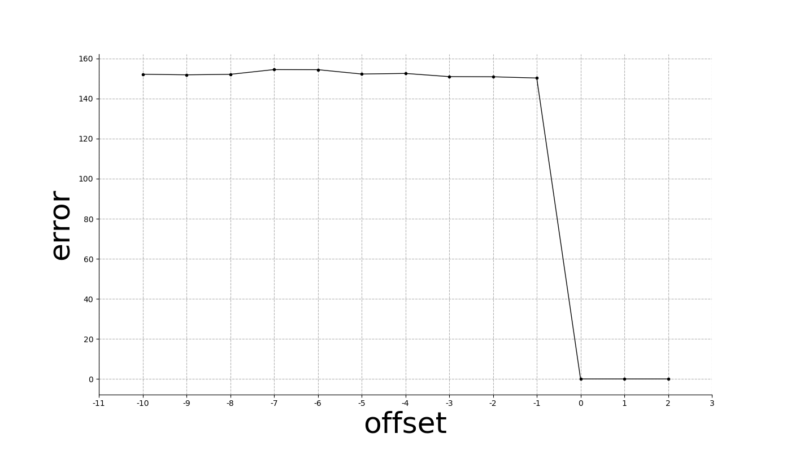

&emsp;&emsp;程序输出 (`stdout`) 如下. 为了避免运行时间过长, 仍然启用了 LP Solver 的多线程, 可能会略微影响复现性.

```plain
Task 1: n = 1200, k = 252, ratio = 0.210000
Task 2: r = 600, error = 175.992249
Task 3: r* = 634
Task 4: errors 152.165668 151.868475 152.109564 154.479162 154.440939 152.267694 152.561381 150.967605 150.885035 150.268453 0.000435 0.000605 0.000692
```

使用 Task 4 的结果绘图如下:

