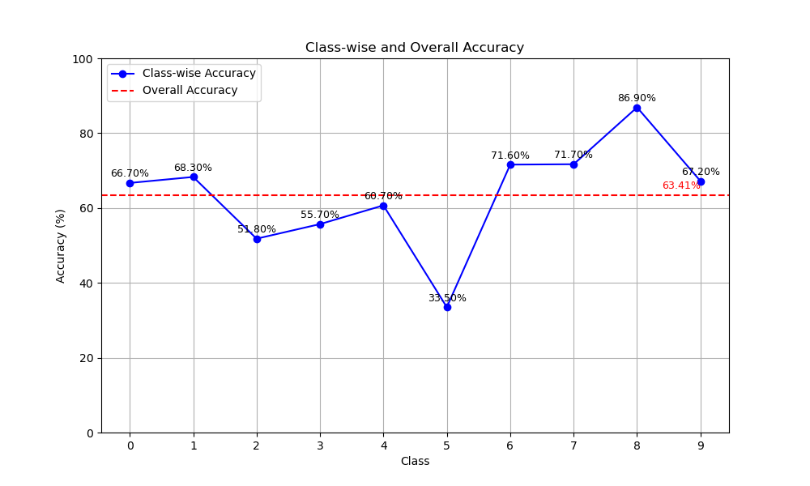
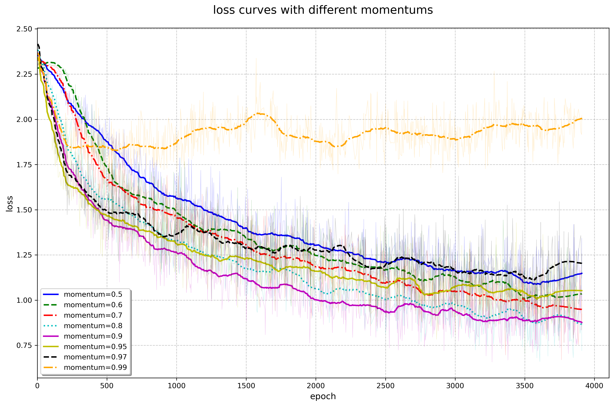

**实验结果**

&nbsp;

**损失曲线** (上图实验结果中取 `momentum=0.9`)

&nbsp;

**关于 momentum 参数**

&emsp;&emsp;此参数即对梯度下降时的 "动量" 的物理模拟, 它表示在计算实际优化步时, 以多大的比例保留上次的梯度用于线性组合. 随着参数逐渐接近 $1$ (如上图 $0.5\to0.9$ 部分), loss 下降速率逐渐提升, 最终 loss 收敛到更低的值. 但当参数过于接近 $1$ 时 (如上图 $0.9\to0.99$ 部分), 由于新的梯度对优化方向的影响过小, 训练效率下降, 过大的 momentum 将严重影响训练效果.