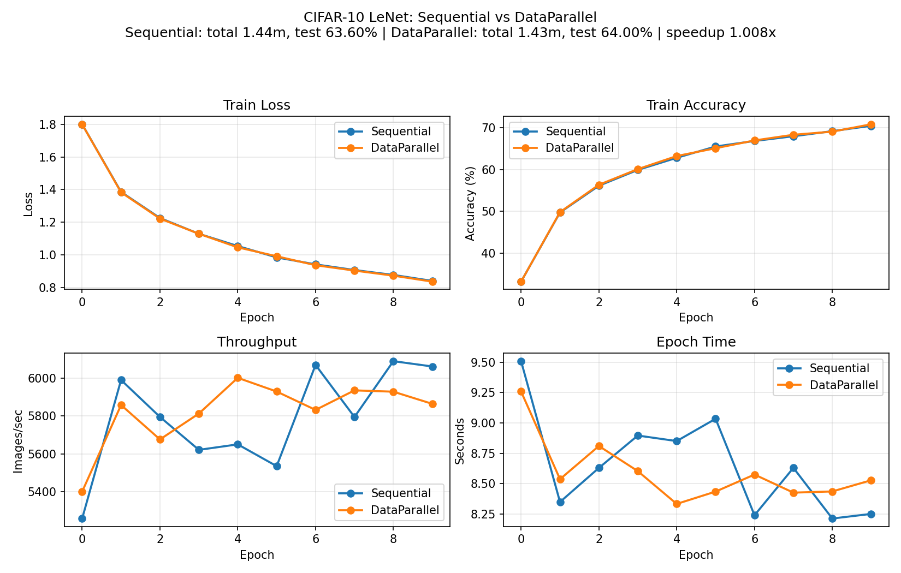

# Task2 实验报告

本实验对同一个 LeNet 模型进行两种训练方式的对比：

- **Sequential**：单设备（单 GPU / CPU）训练，对应脚本 `cifar-seq.py`
- **DataParallel**：使用 PyTorch `torch.nn.DataParallel` 进行数据并行（本实验为演示目的：即使只有 1 张 GPU 也强制包一层 DP），对应脚本 `cifar-par.py`

并在训练结束后生成 JSON 报告与统计图，用于比较速度与精度。

---

## 1. 并行准备

1) **确认 Python/依赖环境**

- 本实验统一使用 conda 环境 `utils`，其中包含了 `torch` 等必要的 module。
	- 运行示例：`conda run -n utils python cifar-seq.py ...`
	- 这样可以避免忘记 `conda activate utils` 导致依赖不一致。

2) **确认 CUDA/GPU 可用性**

- 在代码里打印：
	- `torch.cuda.is_available()`：是否可用 CUDA
	- `torch.cuda.device_count()`：GPU 数量
- 运行时会输出类似：`Device: cuda:0 | GPUs: 1`，用于确认训练设备。

3) **确保计时更可信（避免异步误差）**

- GPU 上的算子很多是异步执行的；我们在每个 epoch 计时前后调用 `torch.cuda.synchronize()`（仅当 device 是 CUDA）来对齐时间线。
- 指标记录：每个 epoch 的 `time_sec`、`images_per_sec` 会写入 JSON（`reports/*.json`），便于后处理与画图。

---

## 2. 数据并行

数据并行的核心思路：**把一个 batch 切分到多个 GPU 上分别 forward/backward，然后聚合梯度更新参数**。

本实验在 `cifar-par.py` 中实现：

- 构造基础模型并移动到主设备：`base_model = LeNet().to(device)`
- 当 `device` 是 CUDA 且检测到至少 1 张 GPU 时，**强制使用 `torch.nn.DataParallel`**（演示目的）：
	- 1 GPU：`device_ids=[0]`（仍然走 DP 的封装与 scatter/gather 流程）
	- 多 GPU：`device_ids=[0,1,...]`
- 保存模型时需要注意：
	- DP 模式下参数在 `model.module` 中，因此保存 `model.module.state_dict()`
	- 非 DP 模式下保存 `model.state_dict()`

此外，两份脚本（seq/par）都统一加入了：

- `--report`：输出 JSON 训练/测试报告
- `--logdir`：TensorBoard 日志输出目录
- `--save`：模型权重保存路径
- `--limit-batches`：快速 smoke test 用（正式实验可不启用）

---

## 3. 性能对比

### 3.1 统计图

我们用 `plot.py` 读取两份报告并生成对比图：

- 输入：`reports/seq_e10.json`、`reports/par_e10.json`
- 输出：`reports/compare_e10.png`
- 图中包含四个子图：Train Loss / Train Acc / Throughput(Images/sec) / Epoch Time

### 3.2 结果汇总（epoch=10）

本次运行得到的关键数字如下：

- **Sequential**
	- 总训练时间：$86.605\,s$
	- 测试集总体准确率：$63.6\%$
	- 吞吐（images/sec）：首个 epoch $5258.48$ → 最后 epoch $6060.35$（整体上升）
- **DataParallel（强制 DP）**
	- 总训练时间：$85.944\,s$
	- 测试集总体准确率：$64.0\%$
	- 吞吐（images/sec）：首个 epoch $5400.61$ → 最后 epoch $5863.30$（整体小幅上升，波动较大）
- **速度比（Sequential / DataParallel）**：约 $1.008\times$（几乎无差别，符合“单卡强制 DP 仅用于演示”的预期）

---

## 复现实验（建议命令）

- 训练（10 epoch）：
	- `python cifar-seq.py --epochs 10 --report ./reports/seq_e10.json --save ./cifar_lenet_seq_e10.pth --logdir ./runs/seq_e10`
	- `python cifar-par.py --epochs 10 --report ./reports/par_e10.json --save ./cifar_lenet_par_e10.pth --logdir ./runs/par_e10`
- 画图：
	- `python plot.py --seq ./reports/seq_e10.json --par ./reports/par_e10.json --out ./reports/compare_e10.png`
